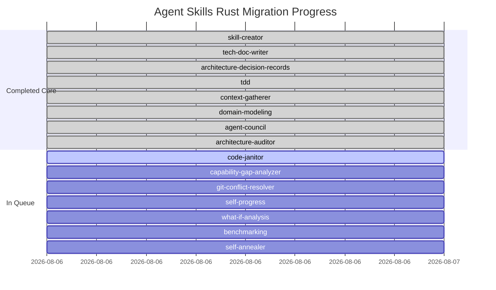

# Rust CLI Migration Progress Tracker

This document tracks the ongoing migration of Agent Skills automation scripts and utilities from Python into native, high-performance compiled Rust binaries (`agent-skills` CLI).

---

## 🏗️ Core Infrastructure & Global Utilities

| Utility / Component | Description | Command | Status |
| :--- | :--- | :--- | :---: |
| **Path Safety Crate** | CWE-22 traversal protection & dynamic repo root | `agent_skills_core::path_safety` | ✅ Completed |
| **Config Safety Crate** | 4-Tier YAML config hierarchy merger | `agent_skills_core::config_safety` | ✅ Completed |
| **Depgraph Engine** | Kahn topological sort & `skills.lock` verifier | `agent_skills_core::depgraph` | ✅ Completed |
| **Global Installer** | Multi-agent symlink manager across AI agents | `agent-skills install` | ✅ Completed |
| **Script Auditor** | Compliance linter (ADR 0001, 0004, 0005) | `agent-skills lint-scripts` | ✅ Completed |
| **Depgraph CLI** | Lockfile generator and verification gate | `agent-skills depgraph` | ✅ Completed |
| **Git Pre-commit Hook** | Automated pre-commit verification pipeline | `.githooks/pre-commit` | ✅ Completed |
| **CI Workflow** | GitHub Actions verification pipeline | `.github/workflows/lint.yml` | ✅ Completed |

---

## 🛠️ Skill Refactoring Status (Topological Order)

Total Skills: **15** | Completed: **8** | Remaining: **7** | Progress: **53.3%**

### Detailed Migration Matrix

| # | Skill Name | Rust CLI Subcommand | Unit Tests | Skill Docs Updated | Status |
| :-: | :--- | :--- | :-: | :-: | :---: |
| 1 | `skill-creator` | `agent-skills skill-creator scaffold \| validate` | ✅ 3 Tests | ✅ 3 Files | ✅ Completed |
| 2 | `tech-doc-writer` | `agent-skills tech-doc-writer audit` | ✅ 2 Tests | ✅ 3 Files | ✅ Completed |
| 3 | `architecture-decision-records` | `agent-skills adr init \| new \| supersede \| reindex \| validate` | ✅ 2 Tests | ✅ 5 Files | ✅ Completed |
| 4 | `tdd` | `agent-skills tdd --detect \| --verify-red \| --verify-green` | ✅ 2 Tests | ✅ 4 Files | ✅ Completed |
| 5 | `context-gatherer` | `agent-skills context-gatherer git-coupling \| symbol-nav \| ast-search` | ✅ 2 Tests | ✅ 4 Files | ✅ Completed |
| 6 | `domain-modeling` | `agent-skills domain-modeling check \| scaffold-entity` | ✅ 2 Tests | ✅ 5 Files | ✅ Completed |
| 7 | `agent-council` | `agent-skills agent-council start \| wait \| results \| clean` | ✅ 2 Tests | ✅ 3 Files | ✅ Completed |
| 8 | `architecture-auditor` | `agent-skills architecture-auditor check \| analyze` | ✅ 2 Tests | ✅ 2 Files | ✅ Completed |
| 9 | `code-janitor` | `agent-skills code-janitor` | ⏳ Pending | ⏳ Pending | 🔄 Next Up |
| 10 | `capability-gap-analyzer` | `agent-skills capability-gap-analyzer` | ⏳ Pending | ⏳ Pending | ⏹️ Queued |
| 11 | `git-conflict-resolver` | `agent-skills git-conflict-resolver` | ⏳ Pending | ⏳ Pending | ⏹️ Queued |
| 12 | `self-progress` | `agent-skills self-progress` | ⏳ Pending | ⏳ Pending | ⏹️ Queued |
| 13 | `what-if-analysis` | `agent-skills what-if-analysis` | ⏳ Pending | ⏳ Pending | ⏹️ Queued |
| 14 | `benchmarking` | `agent-skills benchmarking` | ⏳ Pending | ⏳ Pending | ⏹️ Queued |
| 15 | `self-annealer` | `agent-skills self-annealer` | ⏳ Pending | ⏳ Pending | ⏹️ Queued |

---

## 📏 Quality & Compliance Invariants

Each skill migration must satisfy the following checklist before being marked **Completed**:

- [ ] **TDD Protocol**: Unit test written first (`agent-skills tdd --verify-red`), implementation written to pass (`agent-skills tdd --verify-green`).
- [ ] **Strict Test Assertions**: Tests explicitly assert item types, exact string contents, and non-empty key values.
- [ ] **Path Safety & Config**: Code uses `agent_skills_core::path_safety` and `agent_skills_core::config_safety`.
- [ ] **Documentation Updates**: All markdown documentation files inside `skills/<skill_name>/` (`SKILL.md`, `README.md`, `references/*.md`) updated to reference the new Rust CLI syntax.
- [ ] **Automated Verifications**: `.githooks/pre-commit` and `npx markdownlint-cli` pass cleanly with zero warnings or errors.
