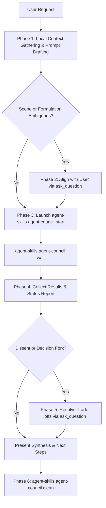

# Agent Council

Collect multiple AI opinions and synthesize one answer using parallel CLI execution with pre-flight user alignment to conserve tokens across external models.

## Pre-Flight Alignment Protocol (Token Conservation)

> [!IMPORTANT]
> **Align Before Dispatching**: Fanning out queries across 3+ external LLM CLIs consumes significant tokens, rate limits, and time across multiple AI providers. You **MUST** align with the user on the exact question formulation and scope via `ask_question` before spawning child processes to avoid wasting tokens on vague or misaligned prompts.

### 6-Phase Execution Workflow



---

## Preparation & Environment Setup

Before running council commands, ensure `PATH` in your executing shell environment includes Cargo and global CLI binary paths:

- **PowerShell (Windows)**:

  ```powershell
  $env:PATH = "$env:USERPROFILE\.cargo\bin;$env:APPDATA\npm;$env:PATH"
  ```

- **Bash / Zsh (Unix)**:

  ```bash
  export PATH="$HOME/.cargo/bin:$PATH"
  ```

> [!NOTE]
> If `agent-skills` is not recognized directly in the current shell session, invoke it using its full binary path:
>
> - Windows: `$env:USERPROFILE\.cargo\bin\agent-skills.exe`
> - Unix: `~/.cargo/bin/agent-skills`

## Environment Health Diagnostics (`doctor`)

To inspect all configured council member CLIs, detected binary paths, version strings, and suggested fixes for missing tools:

```bash
agent-skills agent-council doctor
```

## Usage

### Asynchronous Lifecycle Execution (Recommended for AI Agents)

For background tracking and non-blocking execution across member CLIs:

```bash
JOB_DIR=$(agent-skills agent-council start "your precise question here")
agent-skills agent-council wait "$JOB_DIR"
agent-skills agent-council results "$JOB_DIR" # --verbose (default: true)
agent-skills agent-council clean "$JOB_DIR"
```

### Direct One-Shot Execution

For quick, synchronous query and result synthesis:

```bash
agent-skills agent-council start "your precise question here"
```

---

## Interactive Decision Protocol (`ask_question`)

Follow the interactive decision standard across each phase of execution:

1. **Phase 2 — Pre-Flight Alignment**: If the user's initial prompt is broad, underspecified, or lacks concrete constraints, draft a high-signal prompt with inlined file context and prompt the user via `ask_question` with `(Recommended)` options before launching.
2. **Phase 3 — Unavailable Member Triage**: When member CLIs are missing from `PATH` or fail to respond, alert the user. If critical members are absent, call `ask_question` to confirm whether to proceed with available agents, install missing CLIs, or reconfigure `council.config.yaml`.
3. **Phase 5 — Dissenting Opinion & Trade-Off Resolution**: When member agents disagree on architecture or strategy, present competing trade-offs to the user via `ask_question` with a clear `(Recommended)` recommendation rather than making arbitrary assumptions.
4. **Phase 5 — Follow-Up Action Selection**: After presenting synthesis, use `ask_question` to present structured next steps (e.g., applying recommended changes, writing an ADR, or running a what-if analysis).

---

## Member Availability & Reporting Invariants

> [!IMPORTANT]
> **Mandatory Member Status Reporting**: You MUST explicitly report the availability and response status of each configured council member to the user in your final synthesis.
>
> - **Report Status of All Configured Members**: Provide a status breakdown (e.g. `[Responded]`, `[Missing CLI]`, `[No Response / Failed]`) showing which configured agents participated.
> - **Explicitly Report Missing or Non-Responsive Agents**: If any configured member CLI was missing from `PATH` or failed to return a response, you MUST alert the user and identify the unusable/failed agent(s). Do not silently omit them.
> - **All-Agents-Failed Alert**: If no configured member agents return a response, explicitly notify the user and provide actionable guidance to check CLI installation in `PATH` or reconfigure `council.config.yaml`.

## Headless Execution & Prompt Guidelines

> [!TIP]
> **Pass Self-Contained Context in Prompts**: Member CLIs execute headlessly in background sub-shells without interactive user access. When formulating council questions, inline all critical context (such as code diffs, file snippets, or issue descriptions) directly into the prompt string so member agents do not fail on interactive permission prompts or remote repo auth limits.
>
> **Automatic PATH Auto-Enrichment**: `agent-skills` automatically scans standard user package manager directories (`.cargo/bin`, npm, scoop, homebrew) to resolve installed binaries even in stripped-down sub-shells.

---

## References

- [overview.md](references/overview.md) — Workflow and multi-agent synthesis background.
- [interactive-decisions.md](references/interactive-decisions.md) — Standard specification for interactive decision-making with `ask_question`.
- [examples.md](references/examples.md) — Usage examples.
- [config.md](references/config.md) — Member configuration in `council.config.yaml`.
- [requirements.md](references/requirements.md) — Member CLI configuration and checks.
- [host-ui.md](references/host-ui.md) — Host UI checklist guidance.
- [safety.md](references/safety.md) — Safety guidelines.

---

## Completion Criteria

- [ ] Shell environment prepared with Cargo bin and member CLI paths in `PATH`.
- [ ] Context gathered and prompt formulation aligned with the user via `ask_question` prior to dispatch to prevent token waste.
- [ ] Parallel CLI sub-agent processes spawned with repo root CWD context.
- [ ] Availability and response status of all configured council members explicitly reported to the user.
- [ ] User alerted about any member CLIs that were missing, timed out, or produced no response.
- [ ] Member responses collected and synthesized without unhandled process exceptions.
- [ ] Interactive choices (scope clarification, missing CLI triage, trade-off selection, follow-up actions) resolved using the `ask_question` tool protocol.
- [ ] Job logs and temporary process files cleaned up after execution.
