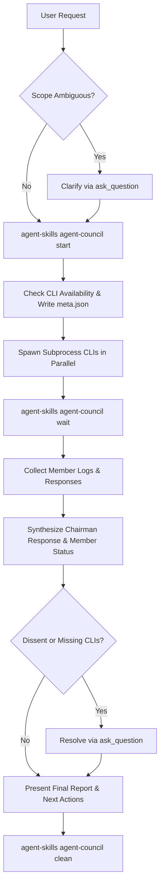

# Agent Council Architecture & Workflow

The **Agent Council** orchestrates multiple AI agent CLIs (`claude`, `codex`, `antigravity`, `copilot`) in parallel to collect diverse perspectives, synthesize consensus, highlight dissenting opinions, and resolve trade-offs via interactive decisions.

---

## Architectural Lifecycle

---

## Member CLI Orchestration

- **Parallel Subprocess Spawning**: Each configured member CLI is invoked as an asynchronous subprocess redirecting output to individual job logs.
- **Native CLI Orchestration**: Managed via the native `agent-skills` CLI with built-in path safety, process management, and configuration loading.
- **Member Availability Tracking**: Each configured member CLI is verified against `PATH` at startup and during results synthesis.
- **Transparent Failure Reporting**: Any member CLI that is missing, fails, or produces no response is explicitly flagged in the council summary rather than silently dropped.
- **Interactive Decision Protocol**: Diverging opinions, missing member triage, and next steps are resolved via structured `ask_question` modals.

---

## Key Invariants

> [!NOTE]
> Member CLIs run in parallel asynchronous processes to prevent sequential blocking delays.
>
> [!IMPORTANT]
> The chairman role synthesizes consensus and highlights dissenting opinions without suppressing critical trade-offs. The chairman MUST explicitly report the availability status of all configured members and use `ask_question` for trade-off resolution.

---

## Configuration & Membership

Member configurations live in `council.config.yaml`. Supported settings include:

- `chairman`: Specifies the chairman agent role or mode (`antigravity`, `claude`, `codex`).
- `members`: List of sub-agent CLI commands, emojis, and display colors.
- `settings.timeout`: Execution timeout in seconds per member CLI.
