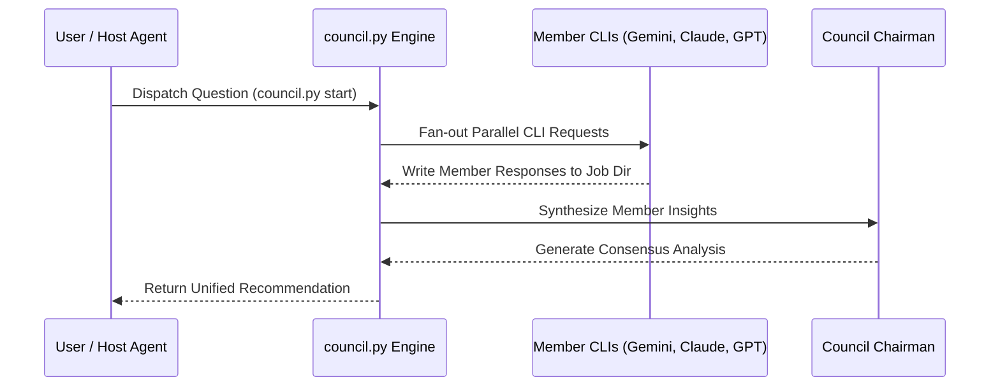

# Agent Council Overview & Architecture

Agent Council enables parallel CLI query execution across multiple AI model engines to collect, evaluate, and synthesize multi-agent perspectives on complex engineering decisions.

---

## The Problem & Friction

Single-agent systems suffer from model bias, blind spots, and specialized blind zones. When designing architecture, evaluating trade-offs, or auditing complex code, relying on a single AI model can produce narrow or biased recommendations.

Agent Council humanizes this friction by orchestrating a council of diverse AI member CLIs, synthesizing their independent analyses into a unified consensus report.

---

## Multi-Agent Execution Lifecycle

---

## Key Invariants

> [!NOTE]
> Member CLIs run in parallel asynchronous processes to prevent sequential blocking delays.

> [!IMPORTANT]
> The chairman role synthesizes consensus and highlights dissenting opinions without suppressing critical trade-offs.

---

## Configuration & Membership

Members are configured declaratively in `council.config.yaml`. The chairman model defaults to the active host agent unless explicitly configured otherwise in `chairman.command`.
