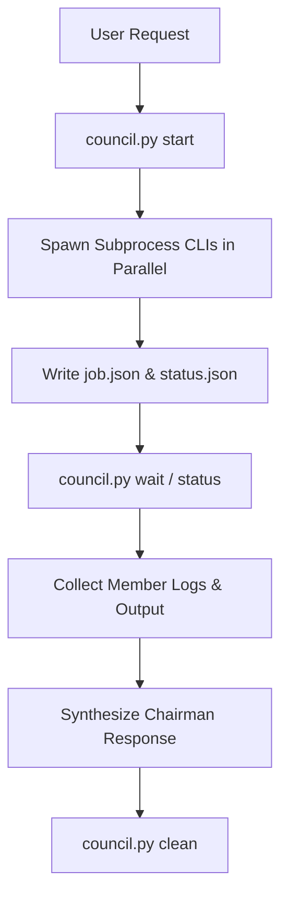

# Agent Council Architecture & Workflow

The **Agent Council** orchestrates multiple AI agent CLIs (`claude`, `codex`, `gemini`, `copilot`) in parallel to collect diverse perspectives, synthesize consensus, and highlight dissenting opinions.

---

## Architectural Lifecycle

---

## Member CLI Orchestration

- **Parallel Subprocess Spawning**: Each configured member CLI is invoked as an asynchronous subprocess redirecting `stdout` and `stderr` to individual `.log` and `.err` files.
- **Zero Third-Party Dependency**: Orchestrated purely via standard library modules (`subprocess`, `json`, `shlex`, `signal`, `hashlib`, `time`, `pathlib`).
- **Dry-Run Mode**: Supports `--dry-run` flag to preview CLI commands without spawning processes.

---

## Key Invariants

> [!NOTE]
> Member CLIs run in parallel asynchronous processes to prevent sequential blocking delays.
>
> [!IMPORTANT]
> The chairman role synthesizes consensus and highlights dissenting opinions without suppressing critical trade-offs.

---

## Configuration & Membership

Member configurations live in `council.config.yaml`. Supported settings include:

- `chairman`: Specifies the chairman agent role or mode.
- `members`: List of sub-agent CLI commands, emojis, and display colors.
- `settings.timeout`: Execution timeout in seconds per member CLI.
