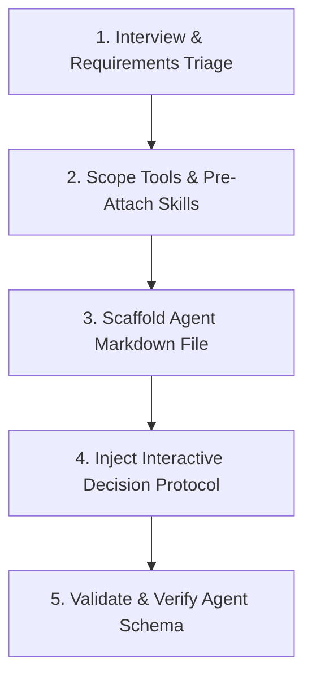

# Agent Creator

Guide and automate the creation of high-quality, specialized Antigravity Custom Agents.

## Overview

**Custom Agents** are file-based agent personas defined in Markdown (`.agents/agents/<name>.md` or `~/.gemini/config/agents/<name>.md`) with YAML frontmatter. They provide specialized scoping, prevent context window bloat, and support true execution symmetry (acting both as standalone Main Agents and concurrent Subagents).

---

## Procedural Workflow

When tasked with creating or customizing an agent, follow this 5-step workflow:



### 1. Interview & Requirements Triage

Determine the agent's role, model tier, and operational mode:

- **Interactive Triage**: Call the `ask_question` tool with `(Recommended)` first-choice options to clarify:
  - Role specialization (e.g. Code Reviewer, QA/TDD Engineer, Refactoring Specialist, Security Auditor).
  - Target scope (Workspace: `.agents/agents/` vs Global: `~/.gemini/config/agents/`).
  - Model tier (`gemini-3.7-flash` for fast throughput vs `gemini-3.7-flash-thinking` for deep reasoning).
  - Execution symmetry (`mainAgent: true`, `subagent: true`).

### 2. Scope Tools & Pre-Attach Skills

Apply the **Principle of Least Privilege**:

- **Tools**: Only grant tools strictly required for the role (refer to [least-privilege-tools.md](references/least-privilege-tools.md)).
  - Default to read-only (`view_file`, `grep_search`, `ask_question`) unless code authoring or execution is explicitly required.
- **Skills**: Pre-attach modular skills from `.agents/skills/` (e.g. `tdd`, `code-janitor`, `self-annealer`) rather than bloating the system prompt.

### 3. Scaffold Agent Markdown File

Use the native Rust CLI to scaffold the agent definition:

```bash
# Model-invoked QA / TDD Engineer agent
agent-skills agent-creator scaffold \
  --name "qa-tdd-engineer" \
  --description "Specialized in Test-Driven Development (TDD) and test suites." \
  --model "gemini-3.7-flash-thinking" \
  --tools "view_file,write_to_file,replace_file_content,run_command,ask_question" \
  --skills "tdd,self-annealer"
```

Or draft manually using [templates/custom-agent-template.md](templates/custom-agent-template.md) / [templates/qa-tdd-engineer.md](templates/qa-tdd-engineer.md).

### 4. Inject Interactive Decision Protocol

Ensure the agent prompt instructs the model to use `ask_question` for any runtime ambiguities:

- Embed the standard decision-making directives into the agent's system prompt (refer to [interactive-protocol.md](references/interactive-protocol.md)).

### 5. Validate & Verify Agent Schema

Run the native Rust CLI validation tool:

```bash
agent-skills agent-creator validate --path .agents/agents/<agent-name>.md
```

Or validate all agents in directory:

```bash
agent-skills agent-creator validate --path .agents/agents/ --json
```

---

## Completion Criteria

- [ ] Agent requirements and scope gathered via `ask_question`.
- [ ] YAML frontmatter schema strictly validated with valid `name`, `description`, `model`, `tools`, and `skills`.
- [ ] Principle of Least Privilege enforced on tool access.
- [ ] Interactive Decision-Making Protocol embedded in agent system prompt.
- [ ] Native agent validation (`agent-skills agent-creator validate`) executed with exit code 0.

---

## References & Resources

- [agent-schema.md](references/agent-schema.md) — Official Antigravity Custom Agent YAML frontmatter specification.
- [least-privilege-tools.md](references/least-privilege-tools.md) — Tool scoping guidelines by agent role.
- [interactive-protocol.md](references/interactive-protocol.md) — Interactive decision-making directives for generated agents.
- [custom-agent-template.md](templates/custom-agent-template.md) — Base template for custom agents.
- [qa-tdd-engineer.md](templates/qa-tdd-engineer.md) — Starter template for QA and TDD agents.
