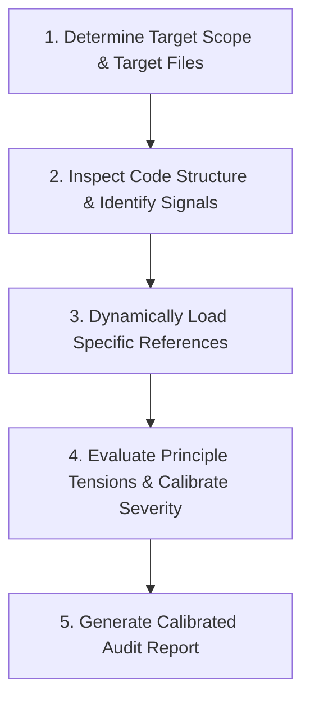

# Architecture Auditor

Evaluate software architecture quality, audit codebases against software principles (SOLID, DRY, YAGNI, KISS, CUPID), resolve principle trade-offs, and suggest concrete code refactorings.

## Overview

The **Architecture Auditor** skill performs structured code reviews focused on architectural health and design principles. It balances classic principles (SOLID, DRY, YAGNI, KISS) with modern pragmatism (CUPID), evaluating design tensions and providing calibrated, actionable refactoring recommendations.

---

## Procedural Workflow

When executing an architectural audit, follow this 5-step workflow:

### 1. Scope & Input Target Resolution

Determine what code to audit:

- `--file <path>`: Single file metric analysis (`cargo run -p agent-skills -- architecture-auditor analyze --file path/to/file.rs`).
- `--check`: Health check audit (`cargo run -p agent-skills -- architecture-auditor check`).

### 2. Inspect Code Context

Read target files using `view_file` or inspect git diffs. Analyze:

- Class line counts, method counts, and public API surface area.
- Inheritance chains, interface implementations, and type checks.
- Import statements (infrastructure vs domain layer boundaries; use `domain-modeling` to define pure domain boundaries).
- Code duplication across functions or modules.

### 3. Dynamic Reference Loading (Progressive Disclosure)

Only load relevant reference guides as needed to evaluate detected signals:

- **SOLID Principles**: Read [references/solid.md](references/solid.md) for SRP, OCP, LSP, ISP, and DIP heuristics.
- **DRY vs YAGNI**: Read [references/dry-yagni.md](references/dry-yagni.md) for knowledge duplication vs speculative generality.
- **CUPID Properties**: Read [references/cupid.md](references/cupid.md) for Composability, Unix-like focus, Predictability, Idiomatic patterns, and Domain alignment. If naming inconsistencies or boundary violations are found, refer to `domain-modeling` to establish Ubiquitous Language.
- **KISS Principle**: Read [references/kiss.md](references/kiss.md) for cyclomatic complexity and indirection reduction.
- **Principle Tensions**: Read [references/principle-tensions.md](references/principle-tensions.md) whenever principles conflict (e.g. DRY vs YAGNI).

### 4. Calibrate Severity & Confidence

Calibrate findings according to [references/audit-report.md](references/audit-report.md):

- **Severity**: `🚨 CRITICAL`, `⚠️ WARNING`, `💡 ADVISORY`.
- **Confidence**: `CONFIRMED` (empirical proof) or `PLAUSIBLE` (heuristic pattern).
- Avoid over-flagging minor stylistic choices as critical violations.

### 5. Report Synthesis

Generate the structured audit report following the schema in [references/audit-report.md](references/audit-report.md). Always include concrete before/after refactoring code diff snippets for flagged issues.

---

## References

- [solid.md](references/solid.md) — SOLID principles heuristics and code smells.
- [dry-yagni.md](references/dry-yagni.md) — DRY vs YAGNI balance and Rule of Three.
- [cupid.md](references/cupid.md) — Dan North's CUPID modern quality framework.
- [kiss.md](references/kiss.md) — Keep It Simple, Stupid heuristics and complexity rules.
- [principle-tensions.md](references/principle-tensions.md) — Trade-off matrix for resolving principle conflicts.
- [audit-report.md](references/audit-report.md) — Report schema, severity levels, and markdown template.

---

## Completion Criteria

- [ ] Target scope and files identified cleanly.
- [ ] Code inspected against SOLID, DRY, YAGNI, KISS, and CUPID heuristics.
- [ ] Severity and confidence calibrated without excessive over-flagging.
- [ ] Calibrated audit report generated with before/after refactoring diffs.
