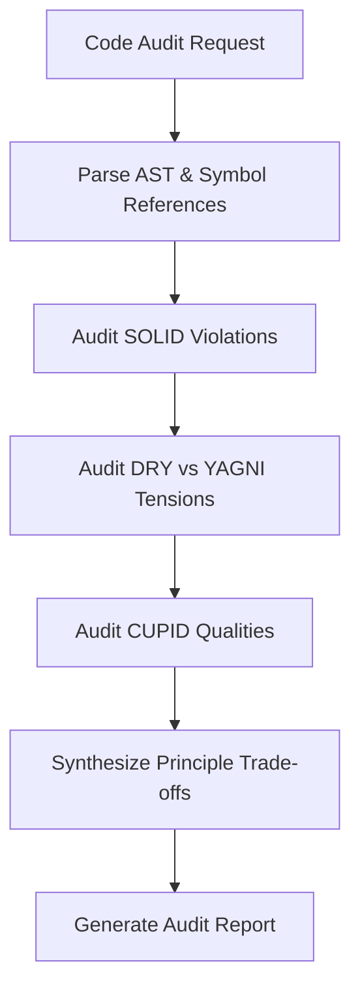

# Architecture Auditor Reference Overview

The **Architecture Auditor** evaluates software design quality against industry principles (SOLID, DRY, YAGNI, KISS, CUPID) and resolves principle tensions.

---

## Audit Workflow

---

## Key Invariants & Trade-Offs

> [!NOTE]
> Architecture principles can conflict with each other (e.g. strict DRY abstraction vs. KISS simplicity). Always resolve principle tensions explicitly.
>
> [!IMPORTANT]
> Audits MUST evaluate code based on empirical usage and maintenance impact, not dogmatic enforcement of rules.

---

## Audit Principles Reference Index

- [solid.md](solid.md) — Single Responsibility, Open/Closed, Liskov Substitution, Interface Segregation, Dependency Inversion.
- [dry-yagni.md](dry-yagni.md) — Knowledge duplication vs coincidental repetition, YAGNI speculative generality, Rule of Three.
- [kiss-cupid.md](kiss-cupid.md) — Keep It Simple Stupid, CUPID properties (Composable, Unix-like, Predictable, Idiomatic, Domain-based).
- [principle-tensions.md](principle-tensions.md) — Heuristics for resolving principle conflicts.
