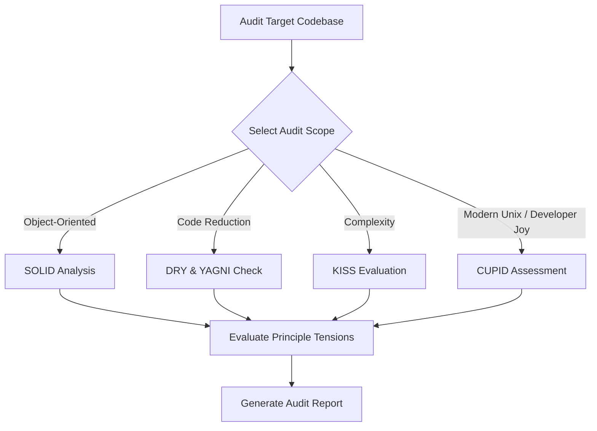

# Architecture Auditor Overview

Architecture Auditor evaluates codebases against core software engineering design principles (SOLID, DRY, YAGNI, KISS, CUPID) and resolves structural tensions across architectural tradeoffs.

---

## The Problem & Friction

As codebases evolve, technical debt accumulates silently. Code duplication, god classes, tight coupling, and premature abstractions make refactoring risky and increase developer cognitive load.

Architecture Auditor humanizes this friction by providing systematic, principle-by-principle audits, detecting design smells, and recommending refactoring strategies.

---

## Audit Workflow & Triage

---

## Key Invariants & Trade-Offs

> [!NOTE]
> Architecture principles can conflict with each other (e.g. strict DRY abstraction vs. KISS simplicity). Always resolve principle tensions explicitly.

> [!IMPORTANT]
> Audits MUST evaluate code based on empirical usage and maintenance impact, not dogmatic enforcement of rules.

---

## Audit Principles Reference Index

- [solid.md](solid.md) — Single Responsibility, Open/Closed, Liskov Substitution, Interface Segregation, Dependency Inversion.
- [dry-yagni.md](dry-yagni.md) — Don't Repeat Yourself vs. You Aren't Gonna Need It trade-offs.
- [kiss.md](kiss.md) — Keep It Simple, Stupid.
- [cupid.md](cupid.md) — Composable, Unix-like, Predictable, Idiomatic, Domain-based.
- [principle-tensions.md](principle-tensions.md) — Resolving trade-offs when principles collide.
- [audit-report.md](audit-report.md) — Standardized audit report template.
