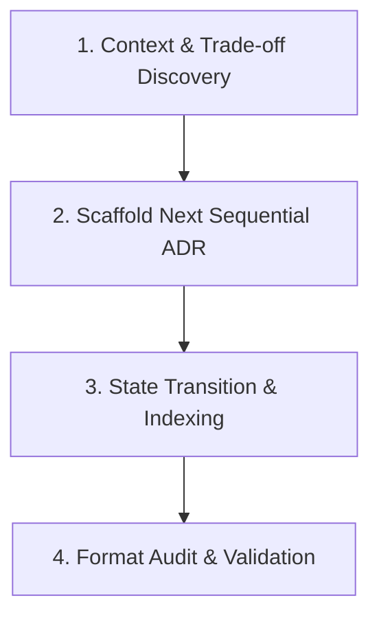

# Architecture Decision Records

Capture, track, and maintain Architectural Decision Records (ADRs) directly in version control. Manage decision state transitions (`Proposed` → `Accepted` → `Superseded`), maintain clean index tables (`docs/adr/README.md`), and enforce MADR/Nygard compliance across the project lifecycle.

## Overview

The **Architecture Decision Records** skill provides CLI automation and procedural directives for logging architecture choices and rationale:

1. **Sequential ID & File Generation**: Automatically assigns next integer IDs (`0001`, `0002`) and scaffolds slugified Markdown files.
2. **Status State Machine**: Handles lifecycle status changes (`Proposed`, `Accepted`, `Rejected`, `Deprecated`, `Superseded by ADR-YYYY`).
3. **Automated Indexing**: Rebuilds the `docs/adr/README.md` catalog table after every decision change.
4. **Validation & Auditing**: Verifies filename formats, metadata headers, and link integrity, seamlessly delegating final GFM layout audits to [tech-doc-writer](../tech-doc-writer/SKILL.md).

---

## Procedural Workflow

When tasked with capturing or managing architecture decisions, follow this 4-step workflow:



### 1. Context & Trade-off Discovery

- Collect decision drivers, constraints, considered alternatives, and consequences.
- If domain boundaries or aggregate concepts are affected, refer to [domain-modeling](../domain-modeling/SKILL.md).
- If evaluating design principles (SOLID/DRY/YAGNI), refer to [architecture-auditor](../architecture-auditor/SKILL.md).

### 2. Scaffold Next Sequential ADR

- Run the ADR CLI generator:

  ```bash
  cargo run -p agent-skills -- adr new "Adopt PostgreSQL for Persistence"
  ```

- Or initialize the ADR repository directory if it does not yet exist:

  ```bash
  cargo run -p agent-skills -- adr init
  ```

### 3. State Transition & Indexing

- When a new decision supersedes a previous one, run:

  ```bash
  cargo run -p agent-skills -- adr supersede --old 0001 --by 0002
  ```

- Rebuild or update the Markdown index table in `docs/adr/README.md`:

  ```bash
  cargo run -p agent-skills -- adr reindex
  ```

### 4. Format Audit & Validation

- Validate ADR structural integrity:

  ```bash
  cargo run -p agent-skills -- adr validate
  ```

---

## Usage

Unified CLI commands:

```bash
# Initialize docs/adr directory with 0000 ADR and README index
cargo run -p agent-skills -- adr init

# Create a new MADR formatted decision record
cargo run -p agent-skills -- adr new "Use Redis for Session Caching"

# Create a Nygard formatted decision record
cargo run -p agent-skills -- adr new "Use Redis" --template nygard

# Supersede ADR 0001 with ADR 0002
cargo run -p agent-skills -- adr supersede --old 0001 --by 0002

# Validate all ADRs in project
cargo run -p agent-skills -- adr validate
```

---

## References

- [madr-guide.md](references/madr-guide.md) — MADR v3.0 format specification and fields.
- [decision-governance.md](references/decision-governance.md) — Architectural decision lifecycle and state transitions.

---

## Completion Criteria

- [ ] ADR directory and templates initialized without errors.
- [ ] Sequential ADR ID numbering and slug generation functioning correctly.
- [ ] Status transitions and bidirectional superseding links maintained.
- [ ] `docs/adr/README.md` index table automatically refreshed.
- [ ] All tests in `tests/test_adr_cli.py` pass cleanly.
- [ ] Code passes `ruff check` and `ruff format`.
- [ ] Documentation passes `markdownlint-cli`.
