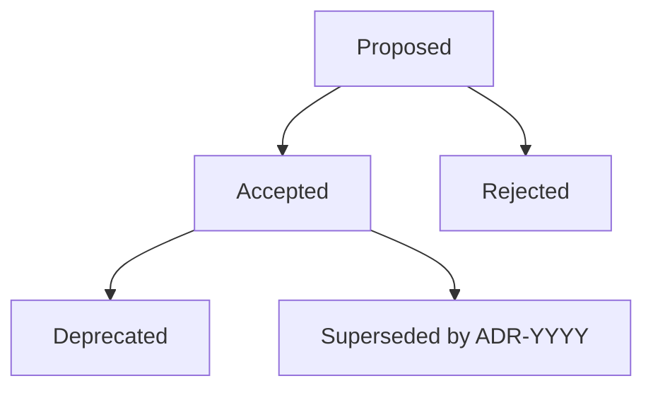

# Architectural Decision Governance & Lifecycle

Best practices for maintaining Architectural Decision Records (ADRs) across the project lifecycle.

## Principles of Decision Records

1. **Immutable History**: Never delete or rewrite past ADRs. If a decision changes, mark the old ADR as `Superseded` and create a new ADR.
2. **Context-Rich Rationale**: Record the *why*, not just the *what*. Future team members should understand the trade-offs considered at the time.
3. **Co-located with Code**: Store ADRs in `docs/adr/` alongside the code repository so architectural history evolves with version control.

## State Transition Workflow

## Maintenance Practices

- **Automated Indexing**: Keep `docs/adr/README.md` updated with every status change.
- **Cross-Linking**: Always link bidirectionally when superseding (the old ADR links to the new ADR, and the new ADR notes which ADR it supersedes).
- **Automated Verification**: Run `adr_cli.py --validate` in CI/CD pipelines to ensure no broken status references or missing files exist.
