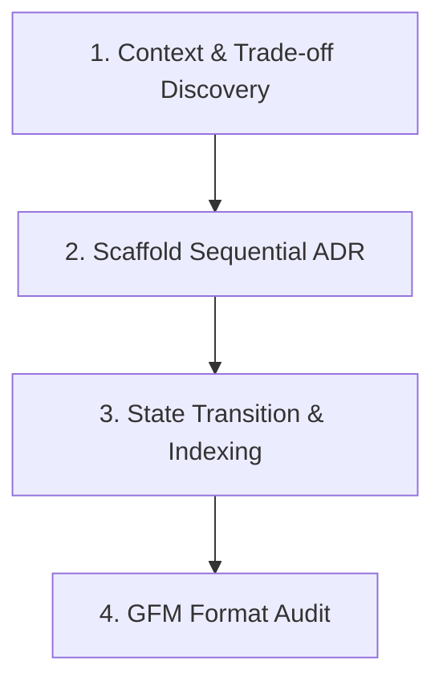

# Architecture Decision Records Overview

Architectural overview and design documentation for the `architecture-decision-records` skill.

## Overview

The Architecture Decision Records (ADR) skill automates decision logging, lifecycle state transitions, and catalog indexing following MADR (Markdown Architectural Decision Records) guidelines.

## Procedural Workflow

## CLI Automation

- `agent-skills adr new "<title>"`: Scaffolds next sequential ADR.
- `agent-skills adr accept <id>`: Sets status to Accepted and updates index.
- `agent-skills adr supersede --old <id> --by <new_id>`: Updates superseded state and bidirectional links.
- `agent-skills adr reindex`: Rebuilds catalog index table in `docs/adr/README.md`.
- `agent-skills adr validate`: Validates ADR titles, sequential numbering, and status headers.
