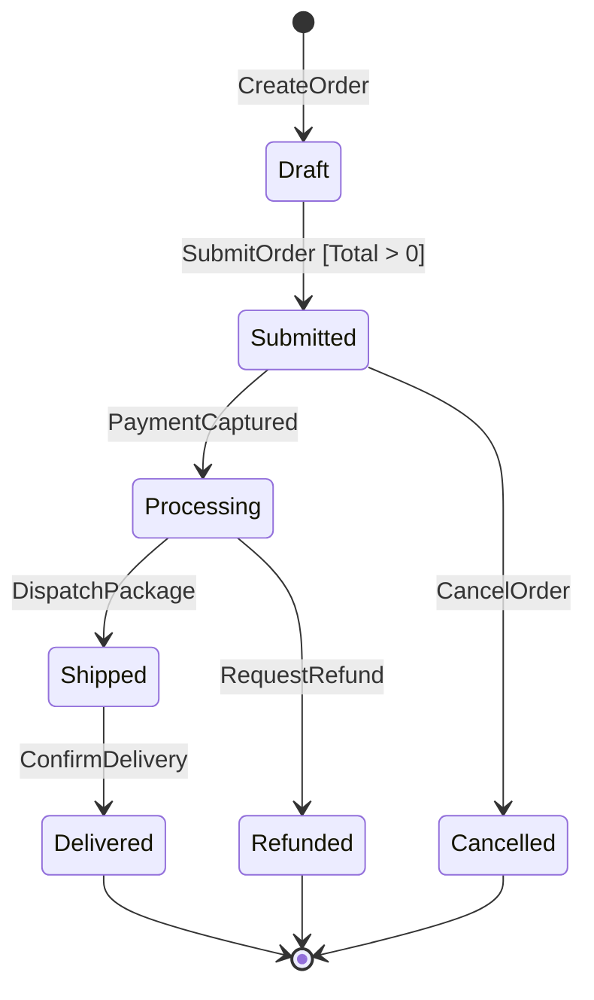

# State Machine & Entity Lifecycle Modeling

Guidelines for modeling stateful domain entities, transition matrices, and Mermaid state diagrams.

---

## 1. Lifecycle State Machine Design

Entities with complex lifecycles (e.g. `Order`, `ApprovalRequest`, `Job`) must explicitly define:

1. **Allowed States**: Exhaustive enumeration of valid lifecycle states.
2. **Permitted Transitions**: Directed transitions between states.
3. **Transition Triggers**: Domain methods/commands that cause state changes.
4. **Side Effects & Events**: Domain events emitted upon entering/leaving a state.
5. **Guard Invariants**: Pre-conditions that must hold before state transition succeeds.

---

## 2. Mermaid State Diagram Templates

Always represent stateful domain entities using standard GitHub-supported `mermaid` code blocks.

### Example: Order Lifecycle State Diagram

---

## 3. State Transition Matrix Template

| Current State | Command / Event | Guard Invariant | Next State | Domain Event Emitted |
| :--- | :--- | :--- | :--- | :--- |
| `Draft` | `SubmitOrder` | `item_count > 0` | `Submitted` | `OrderSubmitted` |
| `Submitted` | `PaymentCaptured` | `payment.status == PAID` | `Processing` | `OrderPaid` |
| `Submitted` | `CancelOrder` | `reason != null` | `Cancelled` | `OrderCancelled` |
| `Processing` | `DispatchPackage` | `tracking_id != null` | `Shipped` | `OrderShipped` |
