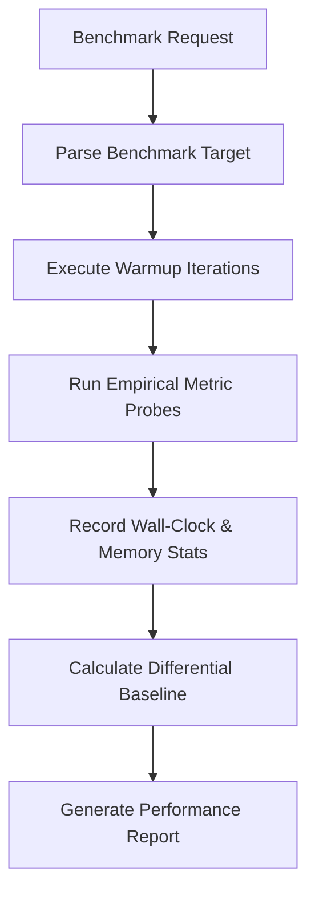

# Benchmarking Architectural Overview

The **Benchmarking** skill provides empirical baseline performance benchmarking, differential analysis, latency/throughput profiling, and expandable metric evaluation.

---

## Benchmarking Execution Pipeline

---

## Core Benchmark Metrics

- **Latency / Wall-Clock Time**: Measured via `time.perf_counter_ns()` with statistical variance (p50, p95, p99).
- **Peak Memory Footprint**: Measured via `tracemalloc` peak memory allocation.
- **Throughput / Assertion Ratio**: Operations executed per second under simulated load.

---

## Key Invariants

> [!NOTE]
> Benchmarks run multiple iterations with warmup cycles to eliminate cold-start overhead variance.
>
> [!IMPORTANT]
> Differential baseline checks fail when performance regression exceeds configured threshold (default: 10%).
