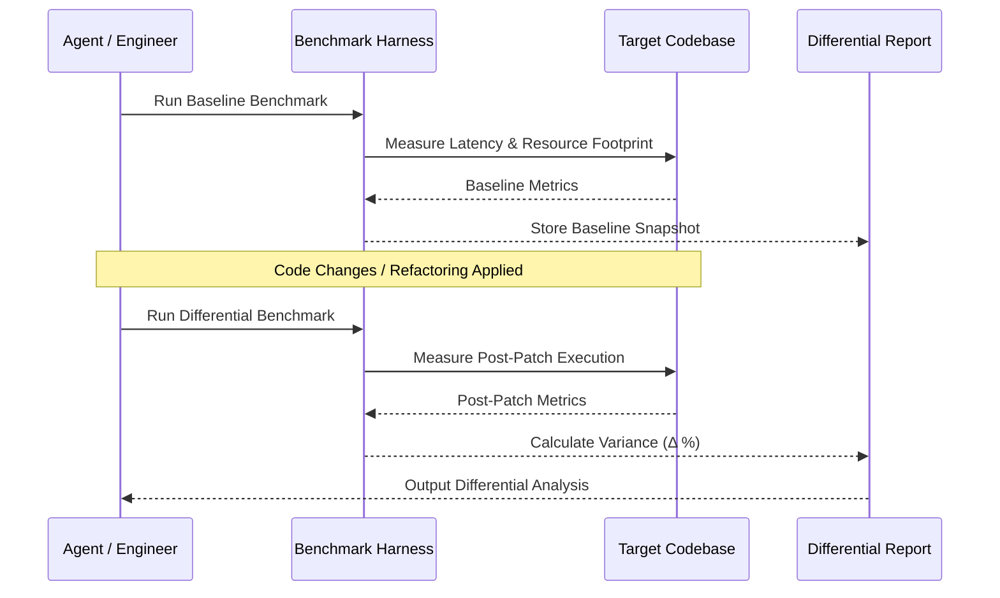

# Empirical Benchmarking Overview

The Benchmarking skill provides empirical verification, baseline differential analysis, and expandable metric evaluations to prevent quality regressions and performance hallucinations.

---

## The Problem & Friction

Optimizing software without empirical measurement leads to speculative refactoring. Developers and AI agents often make architectural changes assuming they improve latency or memory usage, only to introduce hidden bottlenecks.

Benchmarking grounds code changes in empirical data by capturing baseline execution metrics and measuring differential impact after code modifications.

---

## Benchmark Execution Pipeline

---

## Metric Evaluation Invariants

> [!NOTE]
> Benchmarks must run under isolated conditions to minimize OS context-switch noise and variance.

> [!IMPORTANT]
> A performance claim (e.g., "10x faster") MUST be supported by repeatable timing samples and percentage variance output.

---

## Key Metrics Evaluated

- **Wall-clock Execution Time**: Mean, median, and p95 latency.
- **Memory Allocation Footprint**: Peak resident set size (RSS) and allocation rate.
- **Throughput / Assertion Ratios**: Executed ops per second or test assertions per second.
