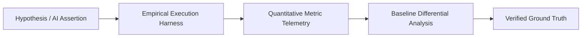

# Philosophy of Benchmarking: Epistemological Proof vs. AI Slop

## 1. The Core Question

> **"How do we know what we said is true is true, and how do we know what we don't know?"**

In software development and AI-assisted engineering, claims are frequently made without empirical validation:

- _"This refactor improves algorithm performance."_
- _"The memory footprint was reduced."_
- _"The code handles all edge cases."_

Without empirical verification, these claims represent unverified hypotheses—or worse, hallucinated **"slop"** (code or statements generated on unverified assumptions).

Benchmarking shifts software engineering from subjective assertion to **empirical proof**.

---

## 2. Epistemological Pillars

### Pillar I: Ground Truth Through Repeatable Execution

An assertion is only validated when executed under measured conditions over multiple iterations. Benchmarking records statistical distributions (mean, median, peak memory RSS, variance) to separate signal from noise.

### Pillar II: Illuminating Blind Spots ("Unknown Unknowns")

Static analysis cannot predict runtime memory allocation spikes, garbage collection pauses, or hidden CPU bottlenecks under load. Systematically running benchmark probes exposes hidden failure modes before code reaches production.

### Pillar III: Data-Driven Feedback Loops

When benchmarks output structured JSON telemetry, downstream self-repair loops (such as `skills/self-annealer`) gain an objective feedback signal to iterate, refine, or roll back code modifications automatically.

---

## 3. Metric Variance & Statistical Confidence

When benchmarking performance:

1. **Warmup Runs**: Initial execution passes discard cold-start overhead (JIT compilation, module imports, OS page caches).
2. **Multiple Iterations**: Running $N \ge 5$ iterations establishes statistical mean and standard deviation.
3. **Differential Deltas**: Baseline comparison measures percentage delta:
   $$\Delta\% = \frac{T_{\text{target}} - T_{\text{baseline}}}{T_{\text{baseline}}} \times 100$$
4. **Hard Assertions**: Execution fails if metrics violate defined thresholds or baseline performance regresses.
