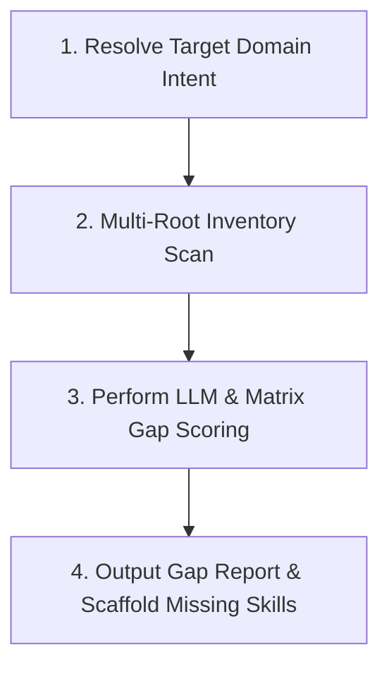

# Capability Gap Analyzer

Measure the distance between currently registered agent skills (both local
workspace and global pre-builtin skills) and the requirements of any target
project domain. Detect missing skillsets, calculate taxonomy heatmaps, and
scaffold draft `SKILL.md` specifications for unhandled domain areas.

## Overview

The **Capability Gap Analyzer** uses a **Multi-Root Two-Tier Hybrid Architecture**:

1. **Tier 1 (Deterministic Multi-Root Inventory Scan)**: On-the-fly parsing
   of all workspace (`skills/`, `.agents/skills/`) and global
   (`~/.gemini/config/skills/`, `~/.claude/skills/`, `~/.copilot/skills/`)
   `SKILL.md` manifests to build a structured inventory JSON with source origin
   tags (`[workspace]` vs `[global]`).
2. **Tier 2 (Dynamic LLM Semantic Evaluation)**: AI agent semantic reasoning
   that compares workspace + global skill capabilities against any target
   domain (even custom or unlisted ones like WebAssembly or Quantum Computing)
   without relying on rigid hardcoded keyword lists.

---

## Procedural Workflow

When executing a capability gap analysis request, follow this 4-step workflow:



### 1. Resolve Target Domain Intent

- **Explicit Domain**: User specifies target domain (e.g. `frontend-web`,
  `data-engineering`, `devops-infra`).
- **Non-Specific Domain**: If the prompt is ambiguous or unspecified, execute
  workspace auto-detection:

  ```bash
  python3 skills/capability-gap-analyzer/scripts/main.py --auto-detect
  ```

  The domain detector inspects workspace markers (`package.json`,
  `pyproject.toml`, `Cargo.toml`, `Dockerfile`, `.sql`, etc.) to infer the
  active project stack.

### 2. Scan Workspace & Global Skill Roots (Tier 1)

- Run the multi-root deterministic inventory scanner:

  ```bash
  python3 skills/capability-gap-analyzer/scripts/gap_analyzer.py --json
  ```

- This parses all `SKILL.md` files across workspace and global customization
  directories, attributing origin tags (`[workspace]` vs `[global]`).

### 3. Perform LLM & Matrix Gap Scoring (Tier 2)

- Combine the Tier 1 inventory dataset with Tier 2 LLM semantic evaluation.
- Dynamically harvest explicit taxonomy domains declared via `domain:` and `tags:` in `SKILL.md` frontmatter headers alongside baseline domains:
  - **Architecture & DDD**
  - **Analysis & Refactoring**
  - **Performance & Benchmarking**
  - **Frontend & UI/UX**
  - **Backend & Data Pipelines**
  - **DevOps & Infrastructure**
  - **Security & Compliance**
  - *(Emergent custom domains like Quantum Computing or Bioinformatics)*
- Assign coverage levels: **Strong** (75-100%), **Partial** (25-74%), or
  **Zero-Zone** (0-24%).

### 4. Output Gap Report & Scaffold Missing Skills

- Render the GFM Taxonomy Heatmap matrix with origin annotations
  (`[workspace]`, `[global]`).
- If missing skills are identified, generate Tier 2 LLM prompt scaffold suggestions via
  [skill-creator](file:///home/phalou/github/louis-pvs/agent-skills/skills/skill-creator/SKILL.md):

  ```bash
  python3 skills/capability-gap-analyzer/scripts/main.py --scaffold-missing
  ```

---

## Usage

Unified CLI entrypoint:

```bash
# Analyze explicit domain across workspace and global skills
python3 skills/capability-gap-analyzer/scripts/main.py --domain frontend-web

# Auto-detect workspace domain mix for non-specific prompts
python3 skills/capability-gap-analyzer/scripts/main.py --auto-detect

# Output JSON structured inventory for agent consumption
python3 skills/capability-gap-analyzer/scripts/main.py --json
```

---

## References

- [overview.md](references/overview.md) — Multi-root two-tier evaluation
  architecture, taxonomy matrix definitions, and domain resolution heuristics.

---

## Completion Criteria

- [ ] Multi-root manifest scanner parses both workspace (`skills/`) and global
      customization roots (`~/.gemini/config/skills/`, `~/.claude/skills/`)
      without errors.
- [ ] Workspace domain auto-detector correctly identifies project manifest
      markers (`package.json`, `pyproject.toml`, `Dockerfile`, etc.).
- [ ] Taxonomy heatmap matrix accurately categorizes Strong, Partial, and
      Zero-Zone domain coverages with `[workspace]` and `[global]` tags.
- [ ] CLI exit codes pass cleanly with `--domain`, `--auto-detect`, and
      `--json`.
- [ ] All Python code passes `ruff check .` and `ruff format --check .`
      without warnings or errors.
