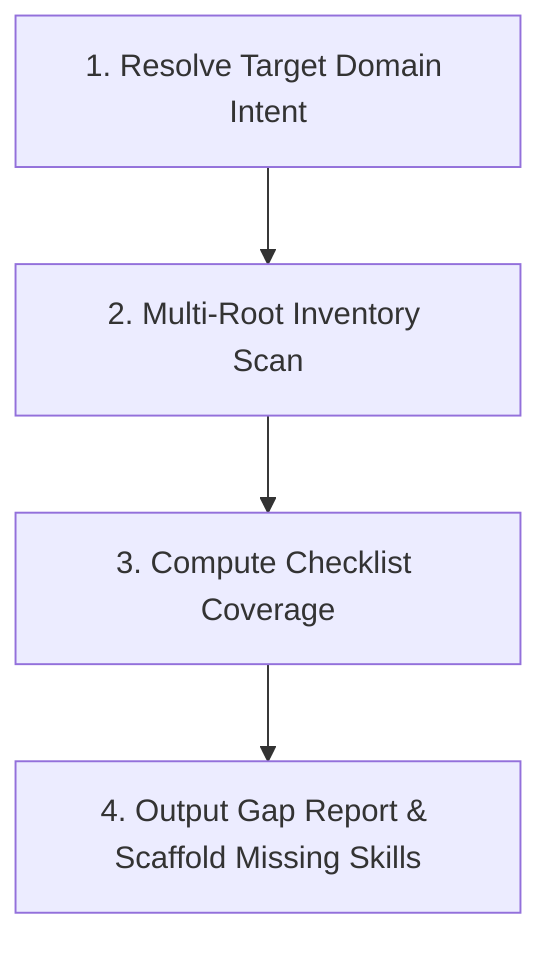

# Capability Gap Analyzer

Measure the distance between currently registered agent skills (both local
workspace and global pre-builtin skills) and the requirements of any target
project domain. Detect missing skillsets, calculate taxonomy heatmaps, and
scaffold draft `SKILL.md` specifications for unhandled domain areas.

## Overview

The **Capability Gap Analyzer** has one deterministic script layer and one
judgment layer supplied by the calling agent — not two algorithmic layers in
code:

1. **Tier 1 (Deterministic Sub-Capability Checklist Scan)** — `gap_analyzer.py`
   parses all workspace (`skills/`, `.agents/skills/`) and global
   (`~/.gemini/config/skills/`, `~/.claude/skills/`, `~/.copilot/skills/`)
   `SKILL.md` manifests, then checks each skill's name/description/tags/**full
   body text** against a fixed list of concrete sub-capabilities per taxonomy
   category (e.g. Security & Compliance decomposes into leaked-secret
   detection, static application security testing, dependency risk auditing,
   permission-boundary review, and governance review). Coverage
   is `covered sub-capabilities / total sub-capabilities` — a real fraction
   with a real denominator, not a lookup table over raw skill-match counts.
   Emergent/custom domains (harvested via `domain:` frontmatter, e.g.
   WebAssembly or Quantum Computing) have no predefined checklist, so they're
   reported as Detected/Not Detected rather than given a fabricated
   percentage.
2. **Calling-agent judgment (applied on top, not a second code tier)** — the
   agent running this skill must sanity-check the Tier 1 output before
   presenting it: does a "covered" item's matched skill actually do that
   thing, or did it just keyword-hit generic prose? Is a Zero-Zone category
   even relevant to this project's real domain (e.g. Frontend for a CLI-only
   repo isn't a gap)? `main.py`'s `DOMAIN_RELEVANT_TAXONOMY` filter handles
   the coarse version of this automatically, but the agent should still
   verify against project reality before reporting a "gap" as real.

---

## Procedural Workflow

When executing a capability gap analysis request, follow this 4-step workflow:



### 1. Resolve Target Domain Intent

- **Explicit Domain**: User specifies target domain (e.g. `frontend-web`,
  `data-engineering`, `devops-infra`).
- **Non-Specific Domain**: If the prompt is ambiguous or unspecified, execute
  workspace auto-detection:

  ```bash
  python3 skills/capability-gap-analyzer/scripts/main.py --auto-detect
  ```

  The domain detector inspects workspace markers (`package.json`,
  `pyproject.toml`, `Cargo.toml`, `Dockerfile`, `.sql`, etc.) to infer the
  active project stack.

### 2. Scan Workspace & Global Skill Roots (Tier 1)

- Run the multi-root deterministic inventory scanner:

  ```bash
  python3 skills/capability-gap-analyzer/scripts/gap_analyzer.py --json
  ```

- This parses all `SKILL.md` files across workspace and global customization
  directories, attributing origin tags (`[workspace]` vs `[global]`).

### 3. Compute Checklist Coverage

- `calculate_taxonomy_heatmap()` checks every skill against a fixed
  sub-capability checklist for each baseline domain:
  - **Architecture & DDD**
  - **Analysis & Refactoring**
  - **Performance & Benchmarking**
  - **Frontend & UI/UX**
  - **Backend & Data Pipelines**
  - **DevOps & Infrastructure**
  - **Security & Compliance**
  - *(Emergent custom domains like Quantum Computing or Bioinformatics,
    harvested from `domain:`/`tags:` frontmatter — reported as
    Detected/Not Detected, no percentage)*
- Coverage levels for baseline domains are computed from the real fraction:
  **Strong** (≥75% of sub-capabilities covered), **Partial** (25-74%), or
  **Zero-Zone** (<25%). Only *workspace* skills count toward the score —
  global skills matching a sub-capability are shown as evidence but don't
  count as workspace coverage.
- Before presenting results, apply judgment: a matched skill is only real
  evidence if its documented behavior actually does that sub-capability, not
  just because a keyword happened to appear in unrelated prose.

### 4. Output Gap Report & Scaffold Missing Skills

- Render the GFM checklist report with origin annotations (`[workspace]`,
  `[global]`) and per-sub-capability evidence.
- If missing skills are identified — and are actually relevant to this
  project's real domain, not just a Zero-Zone baseline category that doesn't
  apply — generate scaffold suggestions via
  [skill-creator](../skill-creator/SKILL.md):

  ```bash
  cargo run -p agent-skills -- capability-gap-analyzer analyze --auto-detect
  ```

---

## Usage

Unified CLI entrypoint:

```bash
# Analyze explicit domain across workspace and global skills
cargo run -p agent-skills -- capability-gap-analyzer analyze --domain frontend-web

# Auto-detect workspace domain mix for non-specific prompts
cargo run -p agent-skills -- capability-gap-analyzer analyze --auto-detect

# Output JSON structured inventory for agent consumption
cargo run -p agent-skills -- capability-gap-analyzer analyze --json
```

---

## References

- [overview.md](references/overview.md) — Multi-root two-tier evaluation
  architecture, taxonomy matrix definitions, and domain resolution heuristics.

---

## Completion Criteria

- [ ] Multi-root manifest scanner parses both workspace (`skills/`) and global
      customization roots (`~/.gemini/config/skills/`, `~/.claude/skills/`)
      without errors.
- [ ] Workspace domain auto-detector correctly identifies project manifest
      markers (`package.json`, `pyproject.toml`, `Dockerfile`, etc.).
- [ ] Checklist report categorizes each baseline domain as Strong, Partial, or
      Zero-Zone from a real `covered/total` sub-capability fraction (not a
      raw skill-match count), with `[workspace]` and `[global]` evidence tags
      and out-of-scope categories filtered from the report.
- [ ] CLI exit codes pass cleanly with `--domain`, `--auto-detect`, and
      `--json`.
- [ ] All Python code passes `ruff check .` and `ruff format --check .`
      without warnings or errors.
