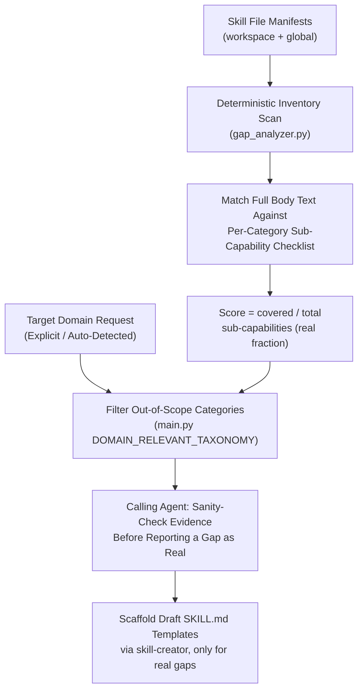

# Capability Gap Analyzer Architectural Overview

The **Capability Gap Analyzer** evaluates the distance between currently
registered skills (both local workspace skills and global pre-builtin skills)
and the requirements of any software engineering domain.

---

## Deterministic Checklist Scan + Calling-Agent Judgment

There is exactly one algorithmic layer in code — `gap_analyzer.py` is a
deterministic keyword/checklist matcher, nothing more. Any "semantic
evaluation" beyond that keyword matching is the responsibility of whichever
agent is running this skill, applied to the JSON/markdown it produces. Earlier
versions of this document described a second in-code "Tier 2 LLM" layer; that
layer never existed in the script — describing it that way overstated what
the tool actually measures.

### Deterministic Inventory + Checklist Scan (`gap_analyzer.py`)

- Runs fast, zero-dependency Python parsing across all workspace (`skills/`,
  `.agents/skills/`) and global customization roots (`~/.gemini/config/skills/`,
  `~/.claude/skills/`, `~/.copilot/skills/`).
- Deduplicates skills by canonical path and skill name.
- Attributes origin tags (`[workspace]` vs `[global]`).
- Matches each skill's name/description/tags/**full SKILL.md body** — not
  just the one-line frontmatter description — against a fixed list of
  concrete sub-capabilities per taxonomy category. A skill only counts as
  covering "Static application security testing (SAST)" if its text actually
  matches that sub-capability's own narrow keywords (`sast`,
  `static-security`); a generic word like `audit` appearing elsewhere in the
  skill's description does not count.
- Score = `covered sub-capabilities / total sub-capabilities` per category —
  a real fraction with a real, fixed denominator. This deliberately
  under-reports rather than over-reports: a workspace with zero real security
  tooling should score low on Security & Compliance, not "100%" because three
  unrelated skills happened to contain the word "audit".
- Classifies coverage across 7 baseline taxonomy categories (each with its
  own fixed sub-capability list — see `TAXONOMY_DOMAINS` in
  `gap_analyzer.py`):
  1. **Architecture & DDD**
  2. **Analysis & Refactoring**
  3. **Performance & Benchmark**
  4. **Frontend & UI/UX**
  5. **Backend & Data Pipelines**
  6. **DevOps & Infrastructure**
  7. **Security & Compliance**
- Emergent/custom domains (harvested from a skill's `domain:` frontmatter,
  e.g. `wasm-audio` or Quantum Computing) have no predefined checklist to
  divide by, so they're reported as **Detected** / **Not Detected** rather
  than assigned a fabricated percentage.

### Calling-Agent Judgment (not a second code tier)

- `main.py`'s `DOMAIN_RELEVANT_TAXONOMY` filters out baseline categories that
  are structurally out-of-scope for the detected project type (e.g. Frontend
  for a CLI-only Python skill library) — this now applies to the displayed
  report itself, not just to scaffold suggestions.
- Beyond that coarse filter, the agent presenting results should still verify
  that a "covered" checklist item's matched skill genuinely does what the
  sub-capability claims, and should read the actual body of any skill
  matched by keyword only before calling something covered — the keyword
  match is evidence to check, not a verdict to repeat verbatim.

---

## Domain Resolution Strategy for Non-Specific Prompts

When a user prompt lacks an explicit target domain (e.g., *"What skills are we
missing?"*), the analyzer executes a 3-level fallback:

1. **Workspace Auto-Detection**: Inspects framework manifests (`package.json`,
   `pyproject.toml`, `Dockerfile`, `.sql`, etc.).
2. **Taxonomy Zero-Zone Identification**: Identifies taxonomy categories with 0
   matched skills.
3. **Interactive Domain Selection**: Prompts the user to pick from top-level
   engineering domain categories if no workspace files exist.
