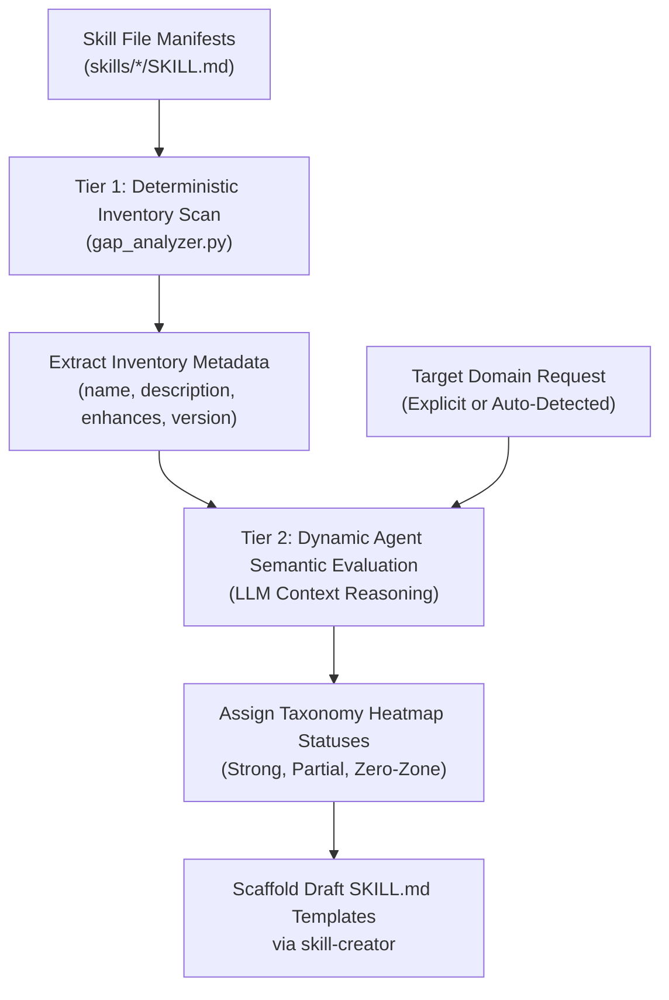

# Capability Gap Analyzer Architectural Overview

The **Capability Gap Analyzer** evaluates the distance between the currently registered skills in `skills/` and the requirements of any software engineering domain.

---

## Two-Tier Hybrid Architecture

### Tier 1: Deterministic Inventory Baseline

- Runs fast, zero-dependency Python parsing across all `skills/*/SKILL.md` files.
- Extracts `name`, `description`, `version`, and `enhances` tags.
- Constructs an on-the-fly JSON dataset of active capabilities.

### Tier 2: Dynamic LLM Semantic Reasoning

- Avoids rigid hardcoded keyword traps.
- Performs semantic capability matching against target domains (e.g., `frontend-web`, `wasm-audio`, `devops-k8s`).
- Classifies capabilities across 7 lifecycle taxonomy categories:
  1. **Architecture & DDD**
  2. **Analysis & Refactoring**
  3. **Performance & Benchmark**
  4. **Frontend & UI/UX**
  5. **Backend & Data Pipelines**
  6. **DevOps & Infrastructure**
  7. **Security & Compliance**

---

## Domain Resolution Strategy for Non-Specific Prompts

When a user prompt lacks an explicit target domain (e.g., _"What skills are we missing?"_), the analyzer executes a 3-level fallback:

1. **Workspace Auto-Detection**: Inspects framework manifests (`package.json`, `pyproject.toml`, `Dockerfile`, `.sql`, etc.).
2. **Taxonomy Zero-Zone Identification**: Identifies taxonomy categories with 0 matched skills.
3. **Interactive Domain Selection**: Prompts the user to pick from top-level engineering domain categories if no workspace files exist.
