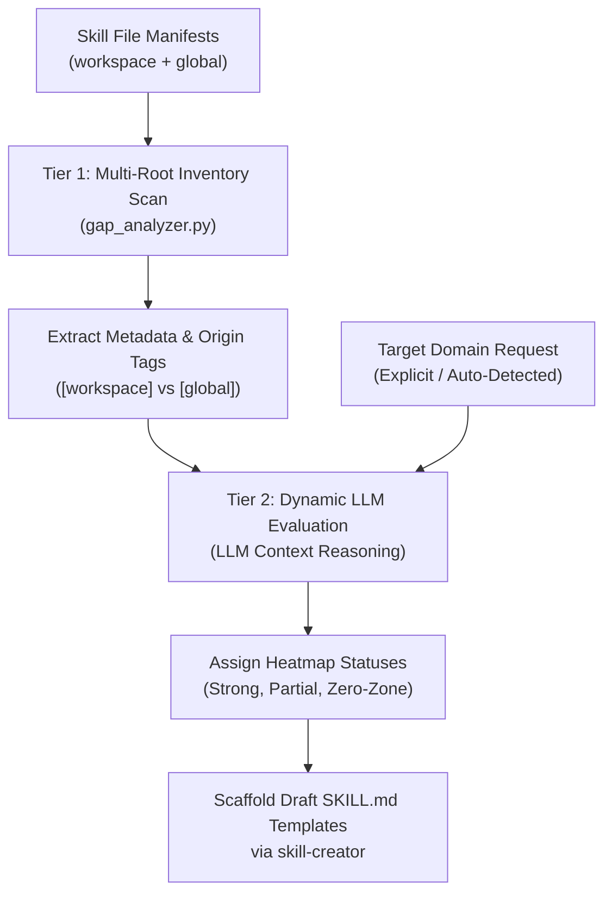

# Capability Gap Analyzer Architectural Overview

The **Capability Gap Analyzer** evaluates the distance between currently
registered skills (both local workspace skills and global pre-builtin skills)
and the requirements of any software engineering domain.

---

## Multi-Root Two-Tier Hybrid Architecture

### Tier 1: Multi-Root Deterministic Inventory Baseline

- Runs fast, zero-dependency Python parsing across all workspace (`skills/`,
  `.agents/skills/`) and global customization roots (`~/.gemini/config/skills/`,
  `~/.claude/skills/`, `~/.copilot/skills/`).
- Deduplicates skills by canonical path and skill name.
- Attributes origin tags (`[workspace]` vs `[global]`).

### Tier 2: Dynamic LLM Semantic Reasoning

- Avoids rigid hardcoded keyword traps.
- Performs semantic capability matching against target domains (e.g.,
  `frontend-web`, `wasm-audio`, `devops-k8s`).
- Classifies capabilities across 7 lifecycle taxonomy categories:
  1. **Architecture & DDD**
  2. **Static Analysis & Testing**
  3. **Performance & Benchmark**
  4. **Frontend & UI/UX**
  5. **Backend & Data Pipelines**
  6. **DevOps & Infrastructure**
  7. **Security & Compliance**

---

## Domain Resolution Strategy for Non-Specific Prompts

When a user prompt lacks an explicit target domain (e.g., *"What skills are we
missing?"*), the analyzer executes a 3-level fallback:

1. **Workspace Auto-Detection**: Inspects framework manifests (`package.json`,
   `pyproject.toml`, `Dockerfile`, `.sql`, etc.).
2. **Taxonomy Zero-Zone Identification**: Identifies taxonomy categories with 0
   matched skills.
3. **Interactive Domain Selection**: Prompts the user to pick from top-level
   engineering domain categories if no workspace files exist.
