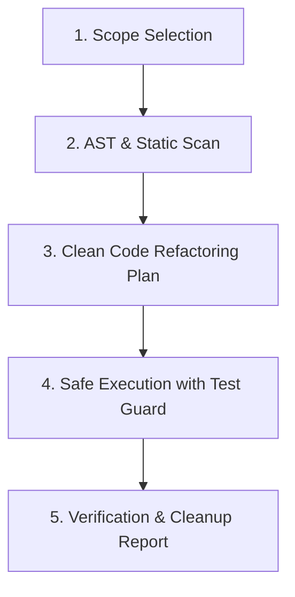

# Code Janitor

Automate code hygiene maintenance, dead code removal, code smell remediation, and enforcement of Clean Code principles.

## Overview

The **Code Janitor** skill performs targeted, safe code sanitation focused on practical hygiene rather than architectural theory. It identifies and fixes concrete code smells (unused imports, dead code, oversized functions, deep nesting, missing type annotations, stale TODOs) and produces actionable refactoring diffs.

**Complementary to `architecture-auditor`**: While `architecture-auditor` evaluates high-level design principles (SOLID, CUPID, principle tensions), `code-janitor` operates at the file and function level to enforce day-to-day code cleanliness — the Boy Scout Rule.

---

## Procedural Workflow

Follow this 5-step janitorial workflow:



### 1. Scope Selection

Determine what code to clean:

- `--file <path>`: Single file janitorial scan.
- `--dir <path>`: Directory or module scan (recursive).
- `--diff`: Scan only uncommitted git changes (Boy Scout Rule — clean what you touched).
- `--severity <level>`: Filter by minimum severity (`critical`, `warning`, `advisory`). Default: all.

### 2. AST & Static Scan

Run the `agent-skills code-janitor` CLI scanner:

```bash
agent-skills code-janitor scan --file <path> --json
```

The scanner detects the following smell categories:

| Category | Smell | Default Threshold |
| :--- | :--- | :--- |
| **Dispensables** | Unused imports | Any unused import |
| **Dispensables** | Dead/unreachable code | Code after `return`/`raise`/`break`/`continue` |
| **Bloaters** | Oversized functions | > 30 lines |
| **Bloaters** | Too many parameters | > 5 parameters |
| **Complexity** | Deep nesting | > 4 indentation levels |
| **Complexity** | High cyclomatic complexity | > 10 branches per function |
| **Documentation** | Missing docstrings | Functions/classes without docstrings |
| **Documentation** | Missing type annotations | Functions without return type hints |
| **Maintenance** | Stale TODO/FIXME markers | Any `TODO` or `FIXME` comment |
| **Modernization** | Verbose guard checks | Legacy `typeof fn === 'function'` or redundant null checks |
| **Modernization** | Imperative boilerplate | Manual iteration setup refactorable to declarative expressions |

> [!TIP]
> Modernization rules are scoped by target file extensions configured in `skills/code-janitor/config.yaml`. Developers can add new file extensions or custom language modernization rules without modifying CLI source code.

### 3. Clean Code Refactoring Plan

For each detected smell, generate a refactoring plan:

1. **Classify severity**: `🚨 CRITICAL`, `⚠️ WARNING`, or `💡 ADVISORY` using calibration from [references/clean-code-heuristics.md](references/clean-code-heuristics.md).
2. **Propose fix**: Generate concrete before/after diff snippets.
3. **Assess blast radius**: Flag fixes that may break callers or tests.
4. **Group by file**: Organize all fixes per-file for batch application.

For smell category definitions and refactoring recipes, load [references/code-smells-catalog.md](references/code-smells-catalog.md) on demand.

### 4. Safe Execution with Test Guard

Apply refactoring changes with safety guardrails:

1. **Pre-flight**: Run existing test suite to establish green baseline.
2. **Apply fixes**: Execute refactoring changes incrementally (one smell category at a time).
3. **Post-fix verification**: Re-run test suite after each category.
4. **Rollback on failure**: If tests break, revert the last batch and flag the smell as `MANUAL_REVIEW_REQUIRED`.

### 5. Verification & Cleanup Report

Generate a structured janitorial report following [references/janitor-audit-report.md](references/janitor-audit-report.md):

- Summary of smells detected, fixed, and deferred.
- Before/after diff blocks for each applied fix.
- Remaining manual review items.
- Overall hygiene score improvement.

---

## References

- [clean-code-heuristics.md](references/clean-code-heuristics.md) — Clean Code principles, naming rules, and function size guidance.
- [code-smells-catalog.md](references/code-smells-catalog.md) — Categorized smell catalog with refactoring recipes.
- [janitor-audit-report.md](references/janitor-audit-report.md) — Report schema and markdown template.

---

## Completion Criteria

- [ ] Target scope and files identified cleanly.
- [ ] AST scanner executed without errors (exit code 0).
- [ ] All detected smells classified with severity and confidence.
- [ ] Refactoring diffs generated with before/after code blocks.
- [ ] Test suite passes after applied fixes (no regressions).
- [ ] Cleanup report generated following report schema.
