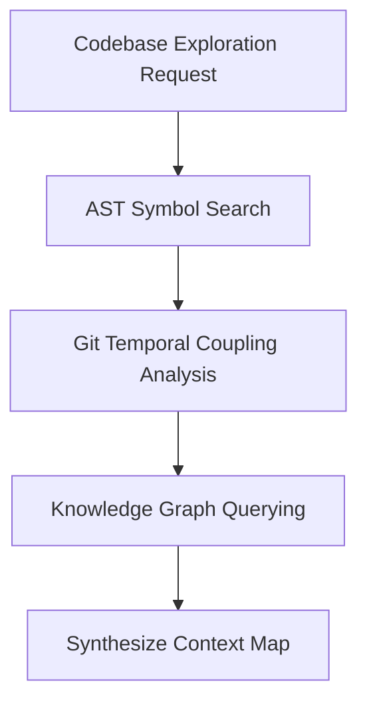

# Context Gatherer Architectural Overview

The **Context Gatherer** maps codebase topology, AST symbol references, temporal git coupling, and structural context across repositories.

---

## Analysis Pipeline

---

## Core Capabilities

- **Symbol Navigation (`symbol_nav.py`)**: Traverses AST definitions, import targets, and call sites.
- **AST Pattern Search (`ast_search.py`)**: Locates class definitions, decoratored handlers, and function signatures.
- **Git Coupling Analysis (`git_coupling.py`)**: Identifies files that historically commit together.

---

## Key Invariants

> [!NOTE]
> `context-gatherer` is purely exploratory and read-only; it makes zero mutating code edits.
>
> [!IMPORTANT]
> Use `context-gatherer` to map existing codebase topology before running prospective refactoring simulations (`what-if-analysis`).
