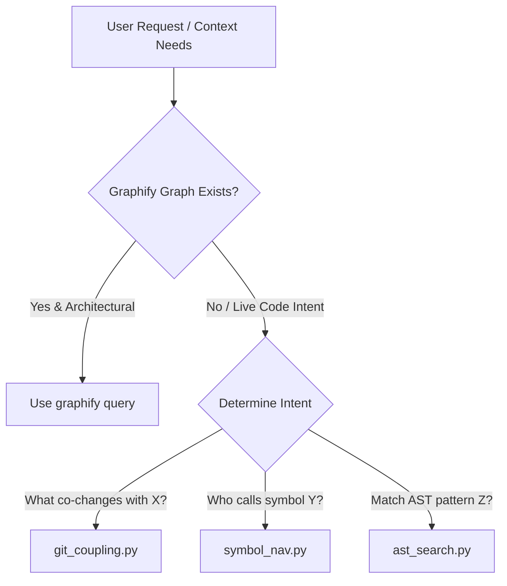

# Context Gatherer Overview & Decision Logic

Context Gatherer provides task-scoped, on-demand codebase context extraction. Unlike static knowledge graphs, it queries live git history, symbol definition call-sites, and AST structures to inform immediate refactoring decisions.

---

## The Problem & Friction

Refactoring code in complex projects often causes unintended side effects in coupled files or distant callers. Relying on manual grepping is slow and misses temporal coupling where files consistently change together in git history.

Context Gatherer solves this friction by providing targeted extraction techniques depending on user intent.

---

## Technique Triage & Decision Flow

---

## Tool Selection Matrix

| Question Type | Best Tool | Rationale |
| :--- | :--- | :--- |
| Component architecture, dependency paths | `graphify` | Static graph with community detection already built |
| What else changes when I modify this file? | `git_coupling` | Live git history, captures recent commit temporal coupling |
| Who calls this function right now? | `symbol_nav` | Live code search, reflects current exact call sites |
| Find all handler implementations | `ast_search` | Structural AST matching on current syntax tree |

---

## Strategy & Principles

> [!NOTE]
> **Detect-and-Degrade**: Fall back gracefully when optional external CLI tools (like `rg` or `ast-grep`) are not available, reverting to Python standard library parsers.

> [!IMPORTANT]
> Context Gatherer pays zero context load when idle because its trigger rules use `disable-model-invocation: true`.
