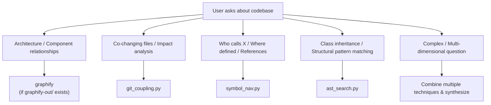

# Technique Selection Heuristics

## Decision Tree

## Technique Comparison

| Technique    | Strength                               | Weakness                                      | Complexity          |
| :----------- | :------------------------------------- | :-------------------------------------------- | :------------------ |
| Git Coupling | Reveals hidden logical dependencies    | Only works with sufficient git history        | Low (stdlib)        |
| Symbol Nav   | Fast, works on any text-based code     | Not AST-accurate, may have false positives    | Low (stdlib + grep) |
| AST Search   | Structurally accurate pattern matching | Language-specific, needs parsers for polyglot | Medium-High         |
| Graphify     | Persistent graph, community detection  | Static snapshot, doesn't capture recency      | Already built       |

## Combining Techniques

For maximum context, combine in this order:

1. **graphify** — architectural overview (if available)
2. **git_coupling** — find co-changing files for the target
3. **symbol_nav** — find callers/definitions in the coupled files
4. **ast_search** — verify structural patterns in the results
