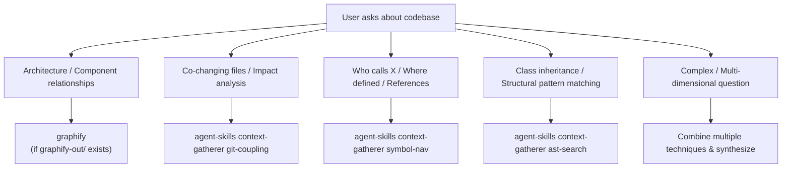

# Technique Selection Heuristics

## Decision Tree

## Technique Comparison

| Technique | Strength | Weakness | Complexity |
| :--- | :--- | :--- | :--- |
| Git Coupling | Reveals hidden logical dependencies | Only works with sufficient git history | Low (native Rust) |
| Symbol Nav | Fast, works on any text-based code | Regex/word-boundary based matching | Low (native Rust) |
| AST Search | Structurally accurate pattern matching | Pattern-based regex matcher | Medium (native Rust) |
| Graphify | Persistent graph, community detection | Static snapshot, doesn't capture recency | Already built |

## Combining Techniques

For maximum context, combine in this order:

1. **graphify** — architectural overview (if available)
2. **git-coupling** — find co-changing files for the target
3. **symbol-nav** — find callers/definitions in the coupled files
4. **ast-search** — verify structural patterns in the results
