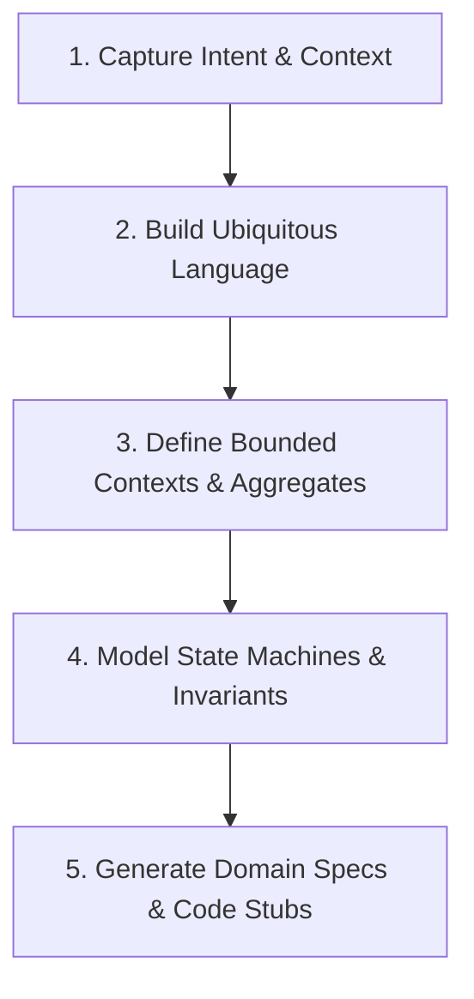

# Domain Modeling

Formalize business domain logic, establish Ubiquitous Language, define DDD aggregate boundaries, separate Value Objects from Entities, enforce self-validating invariants, and model entity state machine transitions.

## Overview

The **Domain Modeling** skill translates user requirements, event storming inputs, or existing codebase structures into clean, type-safe Domain-Driven Design (DDD) artifacts. It ensures business domain logic remains pure, expressible, and completely isolated from infrastructure, ORMs, and transport details.

---

## T-Shape Domain Scope & Boundary

| Skill | Focus | Scope |
| :--- | :--- | :--- |
| **`domain-modeling`** | Business domain design | Ubiquitous Language, Bounded Contexts, Aggregates, Entities vs. Value Objects, State Machine Lifecycles, Invariant Rules |
| **`architecture-auditor`** | Structural audit | SOLID/KISS/DRY/CUPID compliance, code smells, indirection, layer isolation |
| **`context-gatherer`** | Code exploration | Symbol navigation, temporal git coupling, AST patterns, knowledge graph queries |
| **`what-if-analysis`** | Predictive simulation | Blast radius, counterfactual tests, failure pre-emption before refactoring |

---

## Procedural Workflow

When executing a domain modeling request, follow this 5-step workflow:



### 1. Capture Intent & Context

- If exploring an existing codebase, run `context-gatherer` or `graphify` to discover how domain concepts currently exist.
- Identify the primary business problem, core actors, domain actions, and triggers.

### 2. Establish Ubiquitous Language

- Extract key domain terms and create a Glossary of Terms.
- Ensure naming is unambiguous, domain-specific, and consistently used in both domain specs and code symbols.
- Refer to [references/ddd-patterns.md](references/ddd-patterns.md#ubiquitous-language) for naming heuristics.

### 3. Define Bounded Contexts & Aggregates

- **Bounded Context**: Establish clear boundaries separating model meanings (e.g. `User` in Auth Context vs `Customer` in Billing Context).
- **Aggregate Root**: Identify single transactional boundary entities that enforce business invariants across child entities and value objects.
- **Entities vs Value Objects**:
  - **Entity**: Has a unique identity that persists across state changes (e.g., `Order`, `Account`).
  - **Value Object**: Defined entirely by its attributes, immutable, and side-effect free (e.g., `EmailAddress`, `Money`).
- Refer to [references/ddd-patterns.md](references/ddd-patterns.md) for aggregate design patterns.

### 4. Model State Machine Lifecycles & Invariants

- Identify valid entity lifecycle states (e.g., `Draft`, `Submitted`, `Approved`, `Cancelled`).
- Define permitted state transitions and side-effecting domain events triggered upon state change.
- Create a Mermaid state diagram and state transition matrix.
- Refer to [references/state-machines.md](references/state-machines.md) for GFM Mermaid templates.

### 5. Generate Domain Specs & Code Stubs

- Run CLI validation:

  ```bash
  agent-skills domain-modeling check
  ```

- Scaffold a pure domain aggregate root stub:

  ```bash
  agent-skills domain-modeling scaffold-entity Order
  ```

- Synthesize pure domain code stubs containing self-validating invariant constructors.

---

## References

- [overview.md](references/overview.md) — DDD architecture overview, aggregate root guidelines, and clean hexagonal layer isolation.
- [ddd-patterns.md](references/ddd-patterns.md) — Deep dive on Entities, Value Objects, Domain Events, and Ubiquitous Language.
- [state-machines.md](references/state-machines.md) — State machine lifecycle modeling guidelines and Mermaid templates.

---

## Completion Criteria

- [ ] Ubiquitous Language glossary established without ambiguous terms.
- [ ] Bounded Context and Aggregate Root boundaries explicitly defined.
- [ ] Entities vs. Value Objects clearly categorized with invariant validation rules.
- [ ] Mermaid state machine diagram generated for stateful domain entities.
- [ ] CLI health check (`agent-skills domain-modeling check`) executed with exit code 0.
- [ ] Pure domain code stubs free of ORM or transport framework dependencies.
