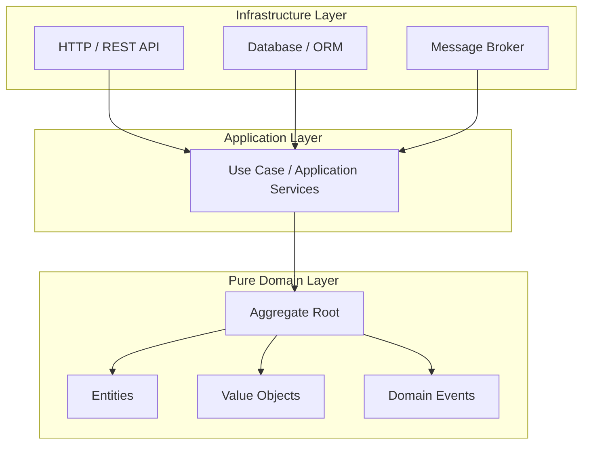

# Domain Modeling Overview

Domain-Driven Design (DDD) provides a disciplined methodology for structuring software systems around complex business models.

---

## Core Philosophy

1. **Ubiquitous Language**: Speak the same language in code (variable names, classes, events) as domain experts speak in business discussions.
2. **Context Isolation**: Model boundaries prevent terms from clashing. `Customer` in Billing is distinct from `User` in Auth or `Recipient` in Shipping.
3. **Pure Domain Center**: Domain models contain zero framework dependencies (no ORM decorators, no HTTP framework bindings, no database drivers).

---

## Hexagonal Layer Isolation

- **Domain Layer**: Pure business logic, entities, value objects, domain rules, and invariants. No external imports.
- **Application Layer**: Orchestrates domain objects to satisfy use cases. Handles transactions, calls repositories, publishes events.
- **Infrastructure Layer**: Implements technical details (PostgreSQL, Kafka, FastAPI, gRPC). Adapts domain interfaces.

---

## Aggregate Root Consistency Rules

1. **Modify via Root Only**: Code outside the aggregate root must never modify internal child entities directly. All state transitions pass through methods on the aggregate root.
2. **Single Transaction Boundary**: One database transaction should commit changes to at most one aggregate root.
3. **Reference by Identity**: Aggregates reference other aggregates by ID only, never by direct object reference.
