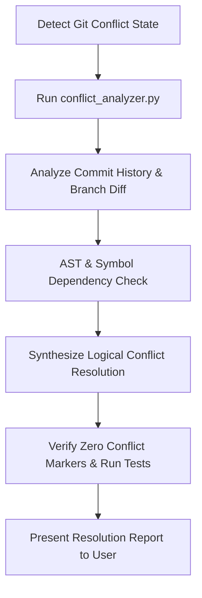

# Git Conflict Resolver

Intelligently analyze and resolve Git merge and rebase conflicts using full repository context, commit histories, AST/symbol references, and automated post-resolution verification.

## Workflow



---

## Procedural Protocol

Follow these 6 steps when resolving Git merge or rebase conflicts:

### 1. Detect Conflict State & Scope

Inspect the workspace repository to identify active operation (`rebase`, `merge`, `cherry-pick`, `revert`) and unmerged files:

```bash
agent-skills git-conflict-resolver analyze
```

### 2. Extract Conflict Blocks & Branch Intent

Run full diagnostic analysis to parse `OURS`, `THEIRS`, and `BASE` (if present) versions, along with recent commit messages for both branches:

```bash
agent-skills git-conflict-resolver analyze --json
```

Key contextual elements to examine:

- **OURS / HEAD**: Intent of the current working branch.
- **THEIRS / INCOMING**: Intent of the incoming branch being merged or rebased onto.
- **BASE (3-way diff)**: The common ancestor baseline before both branches diverted.
- **Commit Messages**: High-level feature or bug fix objectives for each side.

### 3. AST & Code Dependency Analysis

Before modifying conflict markers, inspect surrounding code and project rules:

1. **Symbol & Signature Changes**: If one branch renamed a function or updated parameters while the other added new call sites, adapt the new calls to the updated signature.
2. **Import Statements**: Combine newly added imports from both sides cleanly without duplication or unused imports.
3. **Configuration & Schema Files**: Merge key-value pairs (YAML/JSON/TOML/dependencies) structurally, preserving additions from both branches.
4. **Architectural Rules**: Adhere to project guidelines in `AGENTS.md` (e.g. formatting, type hints, import safety rules).

For deep category heuristics, refer to [resolution-strategies.md](references/resolution-strategies.md).

### 4. Synthesize Logical Conflict Resolution

Apply targeted edits to resolve each conflict block:

- **Do NOT blindly choose `--ours` or `--theirs`** when both branches contain valid edits.
- Preserve business logic and intent from both opposing commits.
- Completely remove all Git conflict markers (`<<<<<<<`, `|||||||`, `=======`, `>>>>>>>`).

### 5. Post-Resolution Verification Loop

Verify clean resolution before staging changes:

1. **Zero Conflict Markers Check**:

   ```bash
   agent-skills git-conflict-resolver analyze --verify
   ```

2. **Syntax & Quality Audit**:
   - Run repo linters and formatters (e.g. `ruff check .` for Python, `npm run lint` for JS/TS).
3. **Automated Test Suite**:
   - Run affected unit test suites to confirm no regressions were introduced.

### 6. Present Resolution Summary

Present a clear summary of all resolved files and resolution rationale using [templates/resolution_report.md](templates/resolution_report.md) before prompting the user to stage or continue rebase/merge.

---

## Completion Criteria

- [ ] Active Git conflict state detected and unmerged files identified.
- [ ] Conflict markers (`<<<<<<<`, `|||||||`, `=======`, `>>>>>>>`) completely removed from all files.
- [ ] Code intent from both branches synthesized logically without regressions.
- [ ] Automated verification (`conflict_analyzer.py --verify`) confirms zero remaining markers (exit code 0).
- [ ] Project linters and unit test suites pass cleanly post-resolution.
- [ ] Detailed resolution summary report presented to user.

---

## References & Resources

- [overview.md](references/overview.md) — 3-way diff mechanics, rebase vs merge marker orientations, and AST call-graph tracing.
- [resolution-strategies.md](references/resolution-strategies.md) — Detailed heuristics for imports, signatures, config files, and deleted/modified conflicts.
- [resolution_report.md](templates/resolution_report.md) — Markdown template for user-facing resolution reports.
