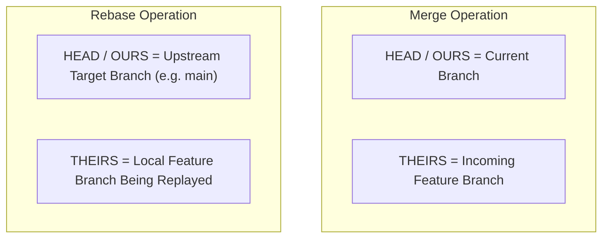

# Git Conflict Resolver Overview

Deep dive guide on Git 3-way conflict mechanics, marker orientations during merge vs rebase operations, AST dependency resolution, and contextual analysis workflows.

## Git 3-Way Merge Mechanics

When Git encounters overlapping changes on the same lines that cannot be automatically resolved, it inserts conflict markers:

```text
<<<<<<< HEAD (OURS)
Current branch state
||||||| BASE (Common Ancestor - enabled via merge.conflictStyle=diff3)
Original code state before divergence
=======
Incoming branch state
>>>>>>> feature-branch (THEIRS)
```

### Rebase vs Merge Marker Orientations

> [!IMPORTANT]
> The meaning of `HEAD` (`OURS`) vs `THEIRS` flips depending on whether you are executing a `git merge` or a `git rebase`:



- **In `git merge`**: `HEAD` (`OURS`) is your current local branch; `THEIRS` is the feature branch being merged in.
- **In `git rebase`**: `HEAD` (`OURS`) is the target branch (e.g., `main` or `upstream`); `THEIRS` is the commit from your local feature branch currently being replayed.

## AST & Symbol Dependency Tracing

Resolving code conflicts requires going beyond line-level diffs:

1. **Upstream Callers**: Check if renaming or refactoring a function signature in branch A breaks call sites modified in branch B.
2. **Type System Integrity**: Ensure dynamic or static type definitions match newly synthesized function signatures.
3. **Import Statements**: Ensure all imported modules in synthesized code blocks are present and un-duplicated.
4. **Configuration Schemas**: For structured formats (JSON, YAML, TOML), parse AST/data trees to ensure syntax remains valid.
