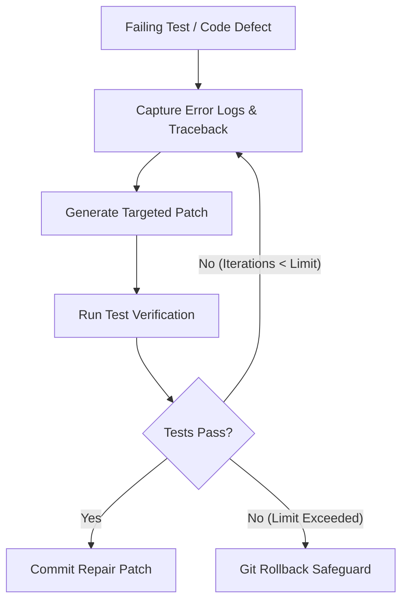

# Self-Annealer Architectural Overview

The **Self-Annealer** enforces bounded self-healing repair loops with strict convergence limits and automated git rollback safeguards.

---

## Annealing Loop Lifecycle

---

## Core Principles

- **Bounded Convergence Limits**: Caps repair iteration loops (default: 3 retries) to prevent infinite repair loops.
- **Git Rollback Safeguard**: Reverts non-converging changes automatically if test suite does not pass cleanly within iteration limits.
- **Zero Symptom Masking**: Ensures underlying contract failures are fixed rather than masking exceptions or commenting out failing assertions.

---

## Key Invariants

> [!NOTE]
> Self-annealing loops require an automated test command or linters to evaluate patch success objectively.
>
> [!IMPORTANT]
> A repair cycle MUST NEVER swallow exceptions or return empty dummy values to force test passes.
