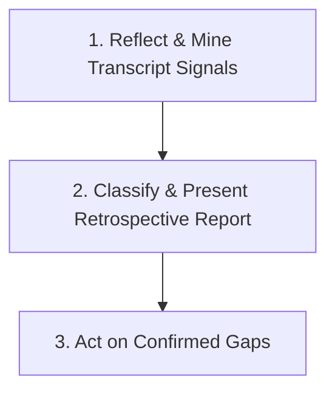

# Self Progress

Identify capability gaps, blind spots, and agent growth opportunities from a completed (or in-progress) conversation session. Outputs a structured retrospective report and feeds confirmed missing skills directly into `skill-creator`.

## When to Use

- Post-session reflection: analyze what went wrong, what was hard, or what tools failed during a complex conversation.
- Identifying missing skills: transform unhandled agent workarounds or user corrections into structured skill proposals.
- Continuous growth: review friction points without modifying global agent rules manually.

## T-Shape Domain Scope & Boundary

- **Descriptive Domain (`self-progress`)**: Backward-looking per-conversation reflection. Mines single-session tool outputs, user corrections, errors, and research queries to generate a retrospective growth report.
- **Systematic Domain (`capability-gap-analyzer`)**: Forward-looking cross-project domain taxonomy auditor. Audits multi-root skill coverage against fixed checklists.
- **Behavioral Learning (`/learn`)**: Native system slash command for recording mandatory user style or pattern preferences.

---

## Procedural Workflow (3 Phases)

Follow these 3 phases sequentially:



### 1. Reflect & Mine Transcript Signals

The agent performs a hybrid reflection:

1. First, reflect on recent conversation memory (errors encountered, user corrections, missing tools/knowledge).
2. Optionally, parse the log transcript JSONL file for programmatic evidence:

   ```bash
   cargo run -p agent-skills -- self-progress analyze --transcript <appDataDir>/brain/<conversation-id>/.system_generated/logs/transcript.jsonl
   ```

   For JSON output:

   ```bash
   cargo run -p agent-skills -- self-progress analyze --transcript <path-to-transcript.jsonl> --json
   ```

### 2. Classify & Present Retrospective Report

Categorize each detected signal into one of four buckets:

- **Missing Skill**: Candidate for scaffolding via `skill-creator`.
- **Missing Rule**: Suggest `/learn` command for style/behavioral corrections.
- **Missing Knowledge**: Candidate for Knowledge Item (KI) or `capability-gap-analyzer` taxonomy update.
- **Platform Limitation**: Documented constraint (no code change possible).

Present the formatted retrospective report to the user and request confirmation/feedback.

### 3. Act on Confirmed Gaps

For any confirmed **Missing Skill**:
Execute `skill-creator` subcommand:

```bash
cargo run -p agent-skills -- skill-creator scaffold --name "<new-skill-name>" --description "<description>" --type complex
```

---

## Completion Criteria

- [ ] Hybrid reflection (memory + transcript signal analysis) completed.
- [ ] Retrospective report generated and presented to user.
- [ ] Confirmed gaps routed to `skill-creator` or suggested via `/learn`.
- [ ] All Rust unit and contract tests in `cargo test --workspace` pass cleanly with exit code 0.
- [ ] `cargo fmt --check` and `cargo clippy --workspace --all-targets -- -D warnings` pass cleanly.

## References

- [overview.md](references/overview.md) — Architectural overview, transcript schemas, and integration guidelines.
