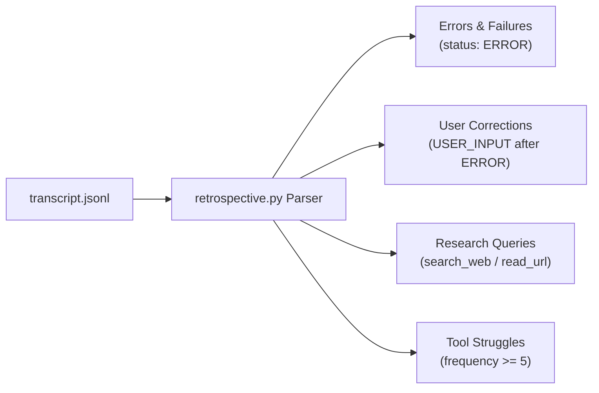

# Self Progress Reference Architecture

Detailed design documentation for the `self-progress` conversation retrospective skill.

---

## 1. Signal Taxonomy & Extraction Heuristics

The retrospective parser (`retrospective.py`) inspects `transcript.jsonl` log files and categorizes execution signals into four distinct vectors:



| Signal Category | JSONL Marker / Pattern | Rationale | Actionable Output |
| :--- | :--- | :--- | :--- |
| **Errors & Failures** | `status == "ERROR"` or error text in step content | Command failed or tool threw unhandled exception | Investigate if missing guardrail or skill rule caused failure |
| **User Corrections** | `USER_INPUT` following an `ERROR` or rejected step | User had to redirect agent strategy | Propose `/learn` rule or skill update |
| **Research Queries** | `search_web`, `read_url_content`, `search_pages` | Agent lacked baseline domain knowledge | Propose Knowledge Item (KI) or skill addition |
| **High-Frequency Tool Chains** | Tool execution count $\ge 5$ in a single session | Inefficient trial-and-error workaround loop | Scaffold automation script to streamline workflow |

---

## 2. Distinction & Boundary Matrix

| Skill | Focus | Scope | Persistence |
| :--- | :--- | :--- | :--- |
| `/learn` | Mandatory user preferences & formatting rules | Global or workspace AGENTS.md | Persistent |
| `capability-gap-analyzer` | Multi-root project taxonomy checklist scan | Whole workspace & global roots | Audit-time snapshot |
| `context-gatherer` | Git temporal coupling & symbol call graph search | Codebase git history & AST | Query-time |
| `self-progress` | In-flight session friction & gap extraction | Single conversation session | Retrospective report |

---

## 3. History Log Maintenance & Token Load Safety

Addressing common concerns around cross-session tracking and context budget:

1. **Context Load Safety (`disable-model-invocation: true`)**:
   - `self-progress` is **user-invoked only**. Its prompt context load is **0 tokens** during normal conversation.
   - It only loads into context when explicitly invoked via `/self-progress`.

2. **Log Maintenance & Growth History**:
   - Transcripts remain in `<appDataDir>/brain/<conversation-id>/.system_generated/logs/`.
   - Optional cross-conversation summaries saved in `~/.gemini/config/self-progress-history.json` store **compact summaries** (only signal counts and skill names, < 1 KB per entry) rather than raw log dumps.
   - Raw JSONL files are automatically cleaned up according to IDE brain log retention policies.

---

## 4. Scaffold Integration Flow

When `self-progress` confirms a missing skill gap, it invokes `skill-creator`:

```bash
agent-skills skill-creator scaffold \
  --name "new-skill-name" \
  --description "Description of the scaffolded skill" \
  --type complex
```

This enforces T-shape boundary preservation and prevents skill duplication.
