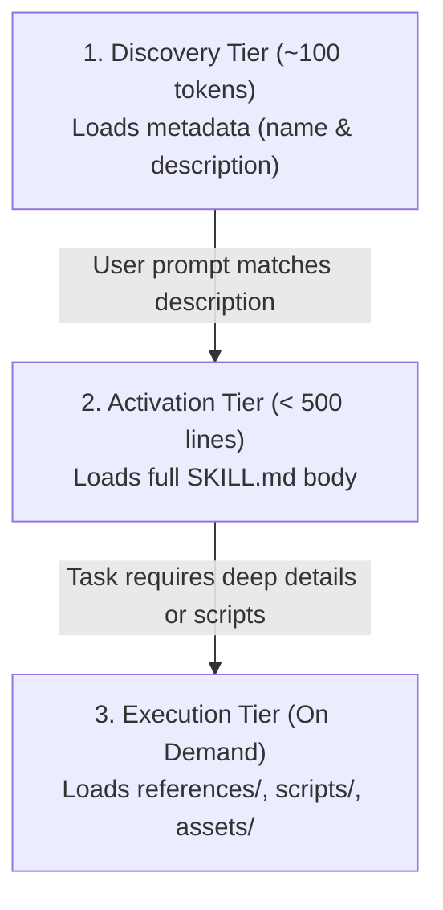

# Agent Skills Specification Reference (`agentskills.io`)

The **Agent Skills Specification** is an open standard for packaging modular capabilities, domain expertise, and automated workflows for AI coding assistants.

## 1. Directory Anatomy

A skill is encapsulated within a dedicated directory:

```text
<skill-name>/
├── SKILL.md             # REQUIRED: YAML frontmatter + procedural instructions
├── references/          # OPTIONAL: Extended documentation, schemas, and manuals
├── scripts/             # OPTIONAL: Executable code (Python, Shell wrappers)
│   └── tests/           # OPTIONAL: Script unit tests
├── templates/           # OPTIONAL: Code/file templates used by the skill
├── examples/            # OPTIONAL: Sample inputs/outputs or workflows
└── assets/              # OPTIONAL: Images, diagrams, static data
```

---

## 2. `SKILL.md` Structure

`SKILL.md` consists of two distinct sections:

### A. YAML Frontmatter (Metadata Header)

Must be placed at the very top of `SKILL.md` enclosed by triple hyphens `---`.

```yaml
---
name: my-skill-name
description: Clear, specific statement of what this skill does and when the agent should trigger it.
license: MIT
compatibility: Linux, macOS, Windows (Python 3.8+)
allowed-tools: run_command view_file write_to_file
---
```

#### Fields & Constraints

| Field | Required | Constraints | Purpose |
| :--- | :--- | :--- | :--- |
| `name` | **Yes** | Max 64 chars. Regex `^[a-z0-9-]+$`. Lowercase letters, numbers, hyphens. No leading/trailing hyphens. | Unique skill identifier. |
| `description` | **Yes** | Max 1024 chars. Must clearly state what the skill accomplishes and explicit trigger phrases. | Used by agents during the **Discovery Tier** to decide whether to activate the skill. |
| `license` | No | Short string (e.g. `MIT`, `Apache-2.0`). | Software license. |
| `compatibility` | No | Max 500 chars. OS or runtime requirements. | Environment eligibility check. |
| `allowed-tools` | No | Space-separated list of approved tool names. | Restricts or hints required tool permissions. |

---

### B. Markdown Body (Instructions)

Follows immediately after the closing `---`.

- **Length Constraint**: Keep main `SKILL.md` body under **500 lines**.
- **Content**: High-level workflow, critical guardrails, edge case handling, and step-by-step procedures.
- **Reference Linking**: Use relative markdown links to files in `references/` for deep technical details (e.g. `[api-docs.md](references/api-docs.md)`).

---

## 3. Progressive Disclosure Architecture

To maximize context window efficiency, skills employ a 3-tier loading mechanism:



1. **Discovery Tier**: At startup, only `name` and `description` are loaded into agent memory (~100 tokens per skill).
2. **Activation Tier**: When a user request matches the skill's description, the agent reads `SKILL.md`.
3. **Execution Tier**: Supplemental files (`references/`, `scripts/`, `assets/`) are read or executed *only when needed* during step-by-step resolution.

---

## 4. Cross-Platform Portability

Skills following this standard operate seamlessly across diverse agent environments:

- **Antigravity / Gemini CLI**
- **Claude Code**
- **Cursor**
- **Codex CLI**
- **VS Code Agent Extensions**
