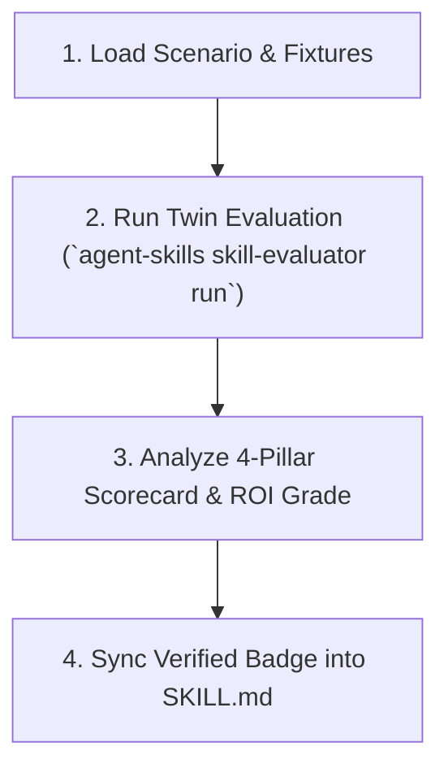

# Skill Evaluator

Empirical ground-truth verification engine that measures the **token savings, tool call reductions, context saturation, and ROI** of agent skills.

## Philosophy: Quantifying Skill Value vs. Prompt Bloat

> **"Does this skill actually make the agent faster and cheaper, or is it just context-window bloat?"**

- **Twin-Session Differential**: Runs identical task prompts across two isolated workspaces—Session A (Baseline standard tools) vs. Session B (Skill-enriched).
- **The 4-Pillar Scorecard**: Evaluates Token Conservation, Cognitive/Tool Overhead Reduction, Task Correctness, and Cost/Latency.
- **Self-Falsifiability & Pruning**: Objectively identifies negative-ROI skills for demotion or deprecation.

---

## Procedural Workflow

When evaluating skill efficiency, follow this 4-step workflow:



### 1. Identify Target Skill & Scenario

Scenarios live in `skills/<skill-name>/benchmarks/scenarios/*.yaml`:

```bash
# Verify health and fixture readiness of evaluation suite
agent-skills skill-evaluator check --skill graphify
```

### 2. Execute Twin-Session Benchmark

Run evaluation with threshold assertions:

```bash
# Run deterministic evaluation with token and tool savings assertions
agent-skills skill-evaluator run \
  --skill graphify \
  --mock \
  --assert-min-token-savings 50.0 \
  --assert-min-tool-savings 50.0
```

### 3. Generate Machine-Readable Report & CI Gating

Output structured JSON scorecards for continuous integration gates:

```bash
agent-skills skill-evaluator run \
  --skill graphify \
  --json \
  --output-dir target/benchmark_reports
```

### 4. Sync Verified ROI Table into SKILL.md

Automatically update the skill's efficiency section:

```bash
agent-skills skill-evaluator sync-badges --skill graphify
```

---

## The 4-Pillar Scorecard Summary

| Pillar | Measured Dimension | Formula |
| :--- | :--- | :--- |
| **1. Token Efficiency** | Total tokens & peak context | \(\Delta_{\text{tokens}} = \frac{T_{\text{base}} - T_{\text{skill}}}{T_{\text{base}}} \times 100\%\) |
| **2. Agent Overhead** | Turns & tool invocations | \(\Delta_{\text{tools}} = \frac{C_{\text{base}} - C_{\text{skill}}}{C_{\text{base}}} \times 100\%\) |
| **3. Task Outcome** | Assertion pass ratio & score | \(\text{Pass Rate}_{\text{skill}} \ge \text{Pass Rate}_{\text{base}}\) |
| **4. Economic Impact** | USD cost & wall-clock time | Composite ROI Score (Grade: S/A/B/C/D/F) |

---

## Completion Criteria

- [ ] Target skill benchmark scenarios authored in `benchmarks/scenarios/*.yaml`.
- [ ] Health check passed cleanly (`agent-skills skill-evaluator check`).
- [ ] Twin-Session evaluation executed without unhandled errors (`agent-skills skill-evaluator run`).
- [ ] Minimum token savings and tool call reduction assertions verified.
- [ ] Verified ROI table synced to target `SKILL.md` (if requested).

---

## References

- [scorecard.md](references/scorecard.md) — 4-Pillar mathematical formulas, composite ROI grading, and cost matrices.
- [scenarios.md](references/scenarios.md) — Declarative `scenario.yaml` authoring specification and fixture guidelines.

## Empirical Efficiency & Benchmark ROI

| Benchmark Scenario | Token Savings | Tool Call Reduction | Grade | Status |
| :--- | :--- | :--- | :--- | :--- |
| Aggregate (1) | **78.6%** | **75.0%** | `S` | Verified |
