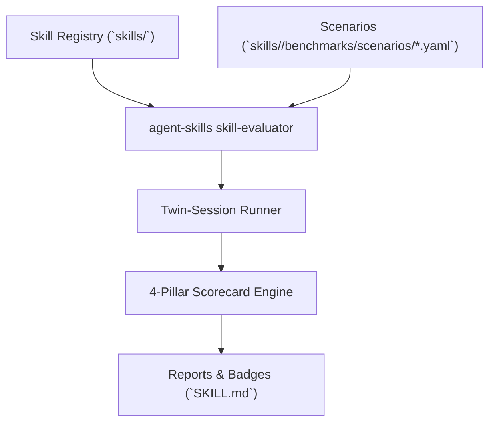

# Skill Evaluator Overview

Comprehensive background, architecture, and design rationale for the Skill Evaluator.

---

## 1. Background & Epistemology

AI agents frequently encounter skill bloat where multiple procedural prompt definitions are injected into context windows without verified empirical benefit.

The **Skill Evaluator** replaces speculative prompt design with **Twin-Session Empirical Evaluation**:

- **Baseline Run**: Executing the exact task prompt in a clean workspace with only standard built-in tools.
- **Skill-Enriched Run**: Executing the exact task prompt in an identical workspace with standard tools + the skill's procedural instructions.
- **Differential Telemetry**: Comparing input/output tokens, conversation turns, tool invocations, execution time, and task success.

---

## 2. Decoupled Architecture

---

## 3. Supported Scenarios & Assertion Types

1. **`regex_match`**: Verifies required strings in agent final outputs or log summaries.
2. **`max_tool_calls`**: Asserts maximum allowed tool invocations to catch futile loops.
3. **`command_pass`**: Asserts test runner or build command passes cleanly (exit 0).
4. **`file_exists`**: Verifies required artifact or code modifications were committed.
