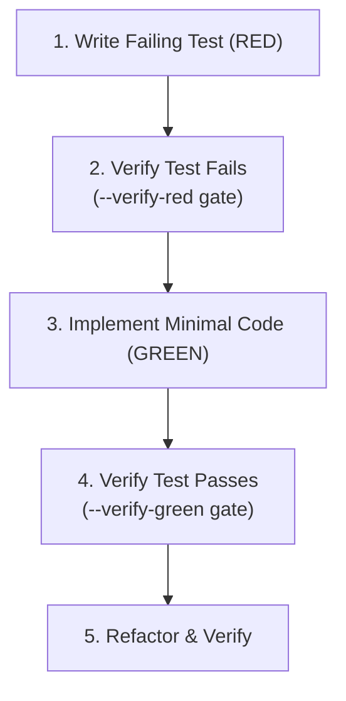

# TDD Skill Overview & Architecture

## Core Principles

Test-Driven Development (TDD) for AI coding agents transforms open-ended code generation into a closed-loop, verifiable system.

## Why Agent Verification Gates Matter

Without explicit `--verify-red` gates, AI models frequently:

1. Write a test that false-passes (e.g., missing assertions or incorrect import mocks).
2. Jump directly to writing implementation code without proving the bug/feature gap existed.
3. Swallow errors silently to report a fake success.

The `agent-skills tdd` CLI tool provides a deterministic check on external exit codes to prevent these failure modes.
