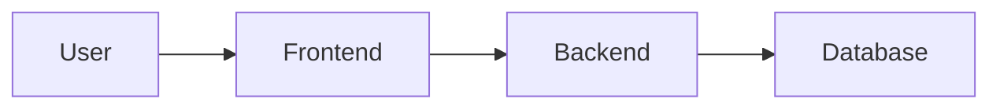
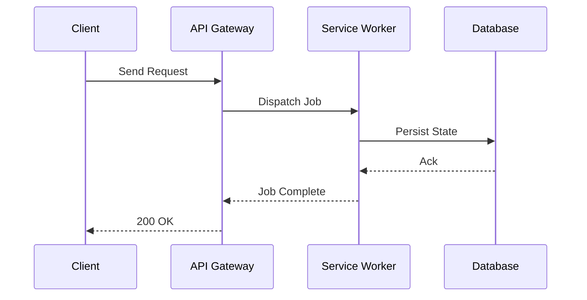

# Document Skeletons & Templates

This reference provides structural skeletons for common GitHub documentation files.

---

## README.md Template

`````markdown
# Project Name

Short, high-impact description of what the project does and the friction it eliminates.

## The Problem & Friction

Briefly document the real friction, inefficiency, or pain point solved by this project.

## Quickstart

```bash
# Clone the repository
git clone https://github.com/user/repo.git

# Install dependencies
npm install

# Run application
npm start
```

## Core Architecture

High-level architecture overview.



> [!NOTE]
> For deep architectural details and design decisions, see [ARCHITECTURE.md](ARCHITECTURE.md).

## Usage & API

```python
import mypackage

mypackage.run()
```

## Contributing

See [CONTRIBUTING.md](CONTRIBUTING.md) for development workflows and submission guidelines.

## License

[MIT](LICENSE)
`````

---

## ARCHITECTURE.md Template

`````markdown
# System Architecture

High-level design philosophy and structural organization of the system.

## Architectural Trade-Offs

Document the core architectural decisions and second-order trade-offs.

| Decision | Benefit | Trade-off / Cost |
| :--- | :--- | :--- |
| Event-driven async bus | High throughput | Eventual consistency complexity |
| In-memory caching | Sub-millisecond latency | Memory footprint & invalidation rules |

## Data Flow & Components



## Component Boundaries

### Component A

Responsibilities and interface contracts.

### Component B

Responsibilities and interface contracts.

## Security & Privacy Model

Security invariants, data boundaries, and privacy protection.
`````

---

## CONTRIBUTING.md Template

`````markdown
# Contributing Guidelines

Thank you for contributing to this project! Please follow these guidelines.

## Development Environment Setup

1. Fork and clone the repository.
2. Install standard dependencies.
3. Run test suite to verify baseline setup.

## Code Quality Standards

- **Linting & Formatting**: All code must pass linting checks before PR submission.
- **Testing**: Every bug fix or feature must include automated unit tests.
- **Documentation**: Update relevant docs and inline comments.

## Pull Request Process

1. Create a feature branch (`git checkout -b feature/my-feature`).
2. Commit concise, well-scoped commits.
3. Push to your fork and submit a PR with a clear summary of changes.
`````
