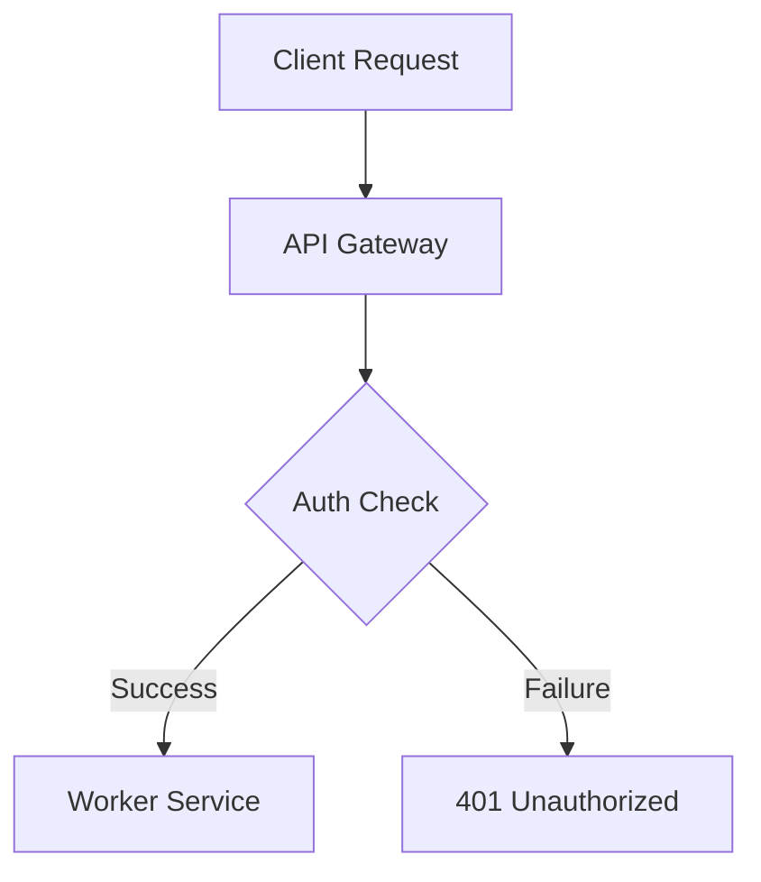

# GitHub Flavored Markdown (GFM) Conventions

This reference defines the required structural and formatting rules for GitHub documentation.

---

## 1. GitHub Alert Callouts

Use GitHub-style alert callouts to highlight key information. Do not nest alerts or use non-standard blockquotes for callouts.

```markdown
> [!NOTE]
> Useful information that users should know, even when skimming.

> [!TIP]
> Helpful advice for doing things better or more efficiently.

> [!IMPORTANT]
> Key information users need to know to achieve their goal.

> [!WARNING]
> Urgent info that needs immediate user attention to avoid problems.

> [!CAUTION]
> Advises about risks or actions that could cause loss of data or breakdown.
```

---

## 2. Mermaid Diagrams (Mandatory Over ASCII Art)

For flowcharts, architecture diagrams, sequence maps, and data pipelines, **always use standard Mermaid blocks (`mermaid`)**. ASCII text art is strictly prohibited.



### Mermaid Guidelines

- Quote node labels containing special characters: `id["Label (Extra Info)"]`.
- Do not use raw HTML tags inside node text.
- Use clean direction (`TD` for top-down, `LR` for left-to-right).

---

## 3. Heading Hierarchy & Structure

- **Single H1**: Exactly one `<h1>` title per document (e.g. `# Project Title`). Multiple H1s break GitHub Table of Contents generation.
- **Sequential Hierarchy**: Use `##` for main sections, `###` for sub-sections. Never skip levels (e.g., going directly from `#` to `###`).
- **No Filler Introductions**: Start every section with a direct statement of purpose.

---

## 4. Collapsible Sections for Large Payloads

Wrap lengthy code listings, extensive API specs, or detailed logs in native GFM collapsible details tags:

````markdown
<details>
<summary>Click to view complete API schema</summary>

```json
{
  "status": "success",
  "data": {}
}
```
````

</details>
```

---

## 5. Privacy & Link Rules

- **Relative Paths**: Always use relative repository links (`docs/architecture.md`) or workspace links.
- **Zero Personal Paths**: Never include absolute user home directories (`/home/username/...` or `C:\Users\username\...`) in git-tracked files.
- **Clean Markdown Links**: Format links as `[link text](file:///path/to/file)` or `[filename](relative/path/to/file)`. Do not surround link text with backticks (`[`code`](path)` is invalid).
