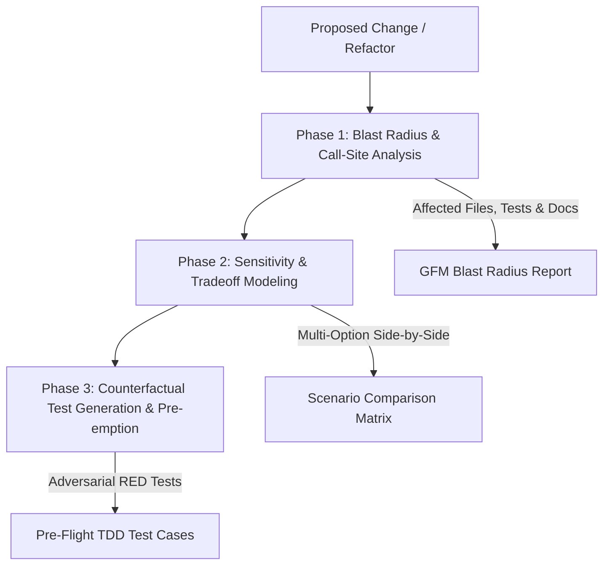

# What-If Analysis

Predictive blast-radius calculation, symbol-reference call-graph parsing, sensitivity scenario modeling, counterfactual RED test case generation, and pre-emptive failure risk analysis for AI agent workflows.

---

## 🎯 Friction & Value Proposition

Refactoring complex codebases often feels like walking a tightrope without a net. Developers and autonomous agents historically rely on **retrospective tools** — running unit tests after making edits (`tdd`), repairing broken builds after CI fails (`self-annealer`), or measuring performance after deployment (`benchmarking`).

**What-If Analysis** introduces **predictive prospective intelligence**. It transforms the developer workflow from _reactive repair_ to _predictive pre-emption_ by simulating the full impact of proposed changes before a single byte of production code is mutated.



---

## 🛠 Usage & Quickstart

```bash
# Primary CLI Entrypoint (Unified Orchestrator)
python3 skills/what-if-analysis/scripts/main.py impact --symbol calculate_score --dir .
python3 skills/what-if-analysis/scripts/main.py scenario --symbol council.py --scenarios "Option A: Async, Option B: Subprocess"
python3 skills/what-if-analysis/scripts/main.py ast --symbol calculate_score --file src/core.py
python3 skills/what-if-analysis/scripts/main.py counterfactual --symbol calculate_score --module src.core --out tests/test_cf.py
python3 skills/what-if-analysis/scripts/main.py preempt --symbol calculate_score --dir .
```

---

## 📚 Documentation Entry Points

- **AI Agent Protocol**: See [SKILL.md](SKILL.md) (used automatically by Antigravity, Claude Code, and Copilot).
- **Architecture & System Overview**: See [references/overview.md](references/overview.md).
- **Risk Heuristics & Rules**: See [references/blast-radius.md](references/blast-radius.md).
- **Usage Examples**: See [examples/usage_example.md](examples/usage_example.md).
- **Starter Templates**: See [templates/counterfactual_template.py](templates/counterfactual_template.py).

> [!NOTE]
> `what-if-analysis` is stdlib zero-dependency compliant (ADR 0001 & ADR 0003) and passes all `skill-creator` agentskills.io standard validation checks cleanly.
