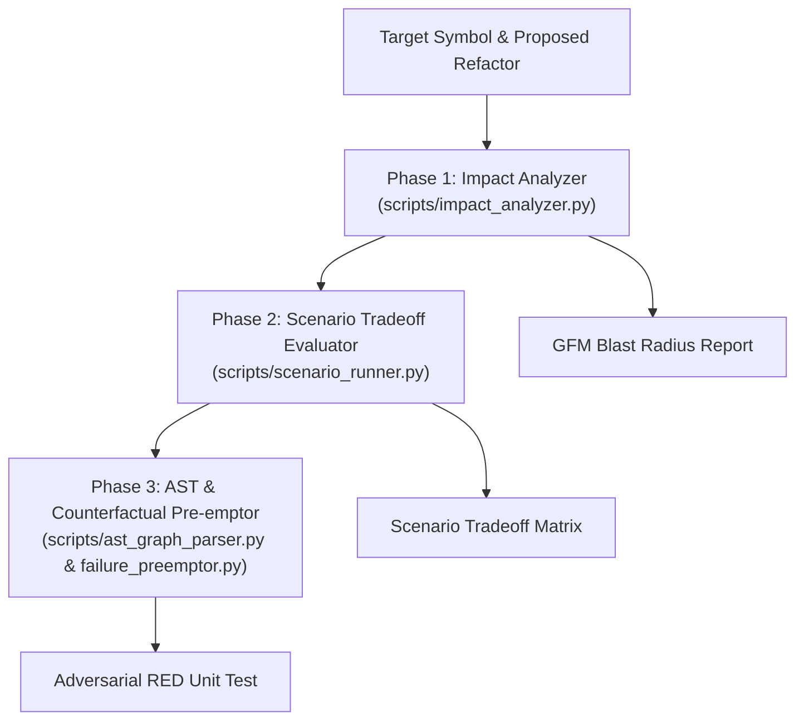

# What-If Analysis Overview

Comprehensive architectural overview and reference documentation for the `what-if-analysis` skill.

## System Architecture & Pipeline

`what-if-analysis` operates as a 3-phase predictive simulation engine:

## Key Components

- **[`scripts/main.py`](../scripts/main.py)**: Unified CLI orchestrator.
- **[`scripts/impact_analyzer.py`](../scripts/impact_analyzer.py)**: Static call-site search, test classification (`_is_test_file`), and doc drift detection (`_is_doc_file`).
- **[`scripts/scenario_runner.py`](../scripts/scenario_runner.py)**: Tradeoff matrix generator with `agent-council` integration and single-agent fallback heuristics.
- **[`scripts/ast_graph_parser.py`](../scripts/ast_graph_parser.py)**: AST NodeVisitor node-level call site parser.
- **[`scripts/counterfactual_generator.py`](../scripts/counterfactual_generator.py)**: Auto-writes adversarial failing (`RED`) unit tests (`--dry-run` compliant).
- **[`scripts/failure_preemptor.py`](../scripts/failure_preemptor.py)**: Shift-left runtime failure risk interceptor.

## Inter-Skill Dependencies

- **`agent-council`**: Optional multi-agent tradeoff probe integration.
- **`tdd`**: Execution runner for generated counterfactual RED test cases.
- **`self-annealer`**: Shift-left failure pre-emption remediation target.
